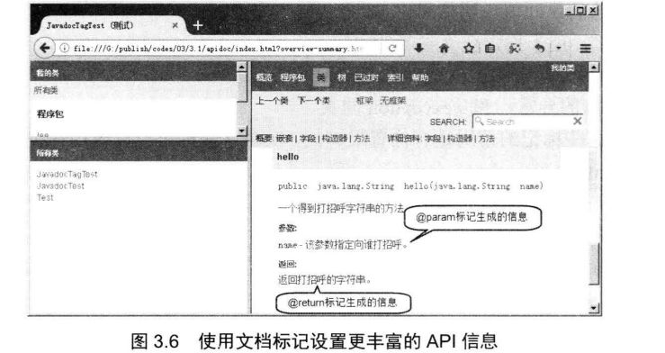
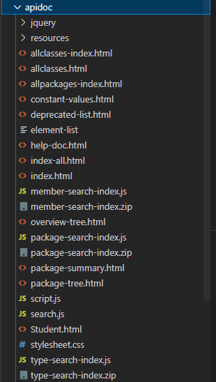
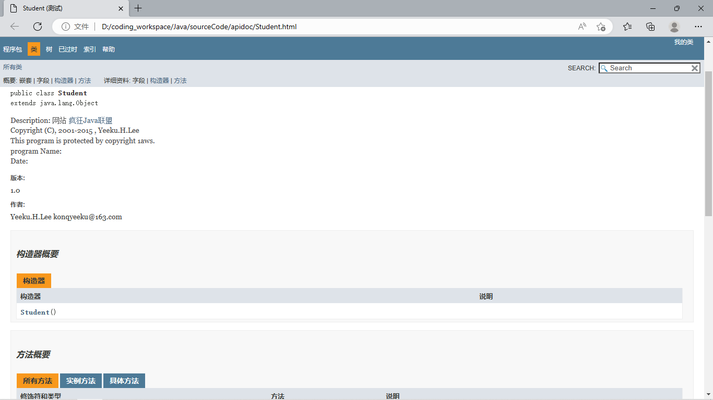

## 3.1java文档注释

> 在对应的类包中：
>
> 1. 在开头使用文件整体文档注释
> 2. 在每个函数上方使用**文档注释**（以`/**`开头，以`*/`结尾，中间补`*`）。
>
> 常用的javadoc标记有：
>
> * @author
> * @version
> * @param
> * @return
> * @exception
> * @throws

#### 3.1.1使用方法

> 注意：Java9开始，文档注释支持HTML5规范

```java
/**	
* Description:
* 网站 <a href="http://www.crazyit.org">疯狂Java联盟</a><br>
* Copyright (C), 2001-2015 , Yeeku.H.Lee<br> 
* This program is protected by copyright 1aws.<br> 
* program Name: <br> 
* Date: <br> 
* @author Yeeku.H.Lee konqyeeku@163.com
* @version 1.0 
*/ 
public class Student
{
    /** 
    * 一个得到类名的方法
    * @return 返回类名
    */ 
    public String Name()
    {
        return "Student";
    }
}
```

> 使用以下命令生成javadoc

```shell
javadoc -d apidoc -windowtitle 测试 -doctitle 学习javadoc工具的测试API文档 -header 我的类
-version -author *Test.java
```



#### 3.1.2实例

```java
/**	
* Description:
* 网站 <a href="http://www.crazyit.org">疯狂Java联盟</a><br>
* Copyright (C), 2001-2015 , Yeeku.H.Lee<br> 
* This program is protected by copyright 1aws.<br> 
* program Name: <br> 
* Date: <br> 
* @author Yeeku.H.Lee konqyeeku@163.com
* @version 1.0 
*/ 
public class Student
{
    /** 
    * 一个得到类名的方法
    * @param 无
    * @return 返回类名
    */ 
    public String Name()
    {
        return "Student";
    }
}
```

> 命令

```shell
javadoc -d apidoc -windowtitle 测试 -doctitle 学习javadoc工具的测试API文档 -header 我的类 -version -author Student.java
```

> 结果



