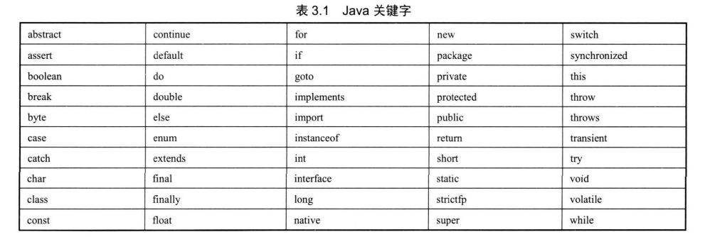

## 3.2标注符和关键字

#### 3.2.1分隔符

##### 1.分号

> 用于语句的分隔

##### 2.花括号

> 定义代码块

##### 3.方括号

> 用于数组

##### 4.圆括号

> 调用方法；优先计算；强转；

##### 5.空格

> 分割语句的不同部分

##### 6.圆点

> 调用类的指定成员

#### 3.2.2标识符规则

标识符必须字母、下画线(_)、美元符($)开头，后面可以跟任意数目、字母、数字、下画线(_)和美元符($)，此处的字母并不局限于26个英文字母，甚至可以包含中文字符、日文字符等。

#### 3.2.3关键字

