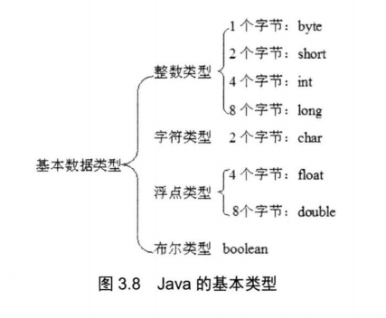

## 3.4基本数据类型

* boolean类型
* 数值类型
	* 整数
	* 字符
	* 浮点



#### 3.4.1整数类型

##### 1.小于int

> 赋值时会自动将对应的数字转换为对应的类型

##### 2.大于int

> 加上后缀L来表示long

```java
byte a = 56;	//true

long bigVal = 999999999999999;	//false

long bigVal2 = 999999999999999L;	//true
```

##### 3.进制

```java
int octalVal = 013;		//八进制以0开头

int hexVal1 = 0x13;		//十六进制以0x开头
int hexVal2 = 0xaf;		

int binVal = 0b11010010;
byte binVal2 = 0b11010010;	//最高位是符号位，此处为负号
```

#### 3.4.2字符类型

> Java支持16位的Unicode编码；

* 直接表示：'A'，'a'
* 转义字符：'\n'，'\t'
* Unicode值表示：'\uXXXX'，其中XXXX表示十六进制整数


##### 1.字符串

```java
String s = "沧海月明珠有泪，蓝田日暖玉生烟";
```

##### 2.路径(使用转义字符)

```java
String road1 = "c:\codes";		//false
String road2 = "c:\\codes";		//true
```

---

#### 3.4.3浮点型

> Java浮点数的存储遵循IEEE754标准

表示形式：

* 十进制形式：5.12、512.0、.512
* 科学计数法：5.12e2、5.12E2
	* 注意：51200是int，但是512E2是double（浮点型默认）

##### 1.后缀

* f表示float
* d表示double

##### 2.特殊值(仅在浮点数)

* 正无穷：POSITIVE_INFINITY
* 负无穷：NEGATIVE_INFINITY
* 非数：NaN

**注意**：正无穷都相等，负无穷都相等。非数不与任意数值（包括自己）相等。

**案例**：

```java
public class FloatTest
{
    public static void main(String[] args)
    {
        float af = 5.2345556f;
        System.out.println(af);
        double a = 0.0;
        
        double c = Double.NEGTIVE_INFINITY;
        float d = Float.NEGTIVE_INFINITY;
        
        System.out.println(c==d);			//负无穷是相等的
        
        System.out.println(a/a);			//0.0/0.0是非数
        
        System.out.println(a/a==Float.NaN);	//非数之间是不相等的
        
        System.out.println(6.0/0==555.0/0);	//正无穷大是相等的
        
        System.out.println(-8/a);			//负数/0.0得到负无穷大
        
        System.out.println(0/0);			//抛出异常：除以0
    }
}

//utf-8下编译运行
//javac -encoding utf-8 .\FloatTest.java
//java FloatTest

/*
运行结果：
5.2345557
true
NaN
false
true
-Infinity
Exception in thread "main" java.lang.ArithmeticException: / by zero
        at FloatTest.main(FloatTest.java:22)
*/


```

---

#### 3.4.4数值中使用下划线

> java7引入，允许在较多的数字中加入下划线来区分位数。

```java
public class UnderscoreTest
{
    public static void main(String[] args)
    {
        int binVal = 0B1000_0000_0000_0000_0000_0000_0011;
        double pi = 3.14_15_92_65_36;
        
        System.out.println(binVal);
        System.out.println(pi);
        
        double height = 8_8_4_8.23;
        System.out.println(height);
    }
}

/*
运行结果：
134217731
3.1415926536
8848.23
*/
```

#### 3.4.5布尔型

> boolean类型用于表示布尔。其值为true和false。（只能）
>
> 标准未规定boolean占几位，大部分计算机占8位。

```java
//1
boolean b1 = true;
boolean b2 = false;
//2
String str = true + "";		//自动转换为“true”
System.out.println(str);
```


