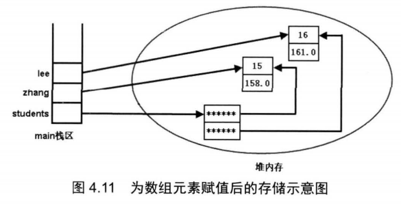

## 4.6深入数组

> 数组是引用类型，数组变量和数组元素在内存中是分开存放的。

#### 4.6.1内存中的数组

> 真正的数组对象在堆内存中，而数组变量在栈中。
>
> 数组的长度是不可变的，但是可以将另一个数组赋给原来的数组变量，这样就发生了长度变化（的假象）。

```java
public class ArrayInman
{
    public static void main()
    {
        int[] a =  {1,2,3};
        int[] b = new int[4];
        System.out.println(a.length);
        System.out.println(b.length);
        b = a;
        System.out.println(b.length);
    }
}
//由此得出，数组由两部分组成，数组引用变量和数组元素对象
```

#### 4.6.2基本类型数组的初始化

> 先动态初始化，再依次赋值

```java
public class PrimitiveArrayTest
{
    public static void main()
    {
        int[] iArr;
        iArr = new int[5];
        for(int i = 0; i < iArr.length; i++)
        {
            iArr[i] = i*5;
        }
    }
}
```

####  4.6.3引用类型的数组初始化

> 所有的类都是引用类型。



```java
class Person
{
    public int age;
    public double height;
    
    public void info()
    {
        System.out.println("我的年龄是："+age+",我的身高是："+height);
    }
}

public class ReferenceArrayTest
{
    Person[] student;				//创建了一个指向多个Person引用的引用
    student = new Person[2];		//初始化指向的Person引用
    
    Person zhang = new Person();	//创建Person实例
    zhang.age = 18;
    zhang.height = 158;
    
    Person lee = new Person();		//创建Person实例
    lee.age = 19;
    lee.height = 168;
    
    student[0] = zhang;				//令引用指向实例
    student[1] = lee;
    
    lee.info();						//指向同一实例，所以信息一致
    student[1].info();
}
```

#### 4.6.4没有多维数组

> 逻辑上存在多维数组，但在内存中不存在。下面演示一个二维数组的例子。

```java
public class TwoDimensionTest
{
    public static void main(String[] args)
    {
        int[][] a;
        
        a = new int[4][];	//初始化多维数组时，可以只指定最左边维的大小;
        					//当然，也可以一次指定每一维的大小:a = new int [4][4];
        
        for(int i = 0; i < a.length; i++)
        {
            a[i] = new int[4];
        }
        
        for(int i = 0; i < a.length; i++)
        {
            for(int j = 0; j < a[i].length; j++)
            {
                a[i][j] = i*j;
                System.out.println("a[" +i+"]["+j+"]="+a[i][j]);
            }
        }
    }
}
```

#### 4.6.5 Java8的增强工具类：Arrays

> Arrays 类里均为 static 修饰的方法（static 修饰的方法可以直接通过类名调用），可以直接通过`Arrays.xxx(xxx)` 的形式调用方法。

##### 查找索引

* `int binarySearch(type[] a, type key)`：**二分法**查询`key`在`a`中出现的索引。不存在返回负数。
	* 升序数组
*  `int binarySearch(type[] a, int fromIndex int tolndex, type key)` ：这个方法与前一个方法类似，但它只搜索数组中从`fromIndex`到`toIndex`索引的元素。

##### 复制数组

*  `type[] copyOf(type[] original, int ength)`：复制数组前n个元素。数组不够则补充默认值。
*  `type[] copyOfRange(type[] original, int from, int to)`: 这个方法与前面方法相似，但这个方法只复制`original` 数组的`from`索引到`to`索引的元素。

##### 比较数组

*  `boolean equals(type[] a, type[] a2)`: 两个数组长度和元素一致返回`true`

##### 批量填充

*  `void fill(type[] ，type val)`: 该方法将会把 数组的所有元素都赋值为 `val`
*  `void fill(type[] a, int fromIndex, int tolndex, type val)`: 该方法与前一个方法的作用相同，区别只是该方法仅仅将数组的 `fromlndex` 到 `tolndex` 索引的数组元素赋值为 `val`

##### 排序

*  `void sort(type[] a)`: 该方法对 数组的数组元素进行排序。
* `void sort(type[] a, int fromIndex ,int toIndex)`: 该方法与前一个方法相似，该方法仅仅对`fromlndex` 到 `toIndex` 索引的元素进行排序。

##### 转字符串

*  `String toString(type[] a)`: 该方法将一个数组转换成字符串。该方法按顺序将多个数组元素连缀在一起，多个数组元素使用英文逗号(,)和空格隔开。

**案例**

```java
import java.util.*;
public class ArrayTest
{
    public static void main(String[] args)
    {
        int[] a = new int[]{3,4,5,6};
        int[] a2 = new int[]{3,4,5,6};
        
        System.out.println("a数组和a2是否相等:"+ Arrays.equals(a,a2));
        
        int[] b = Arrays.copyOf(a,6);
        System.out.println("a数组和b是否相等:"+ Arrays.equals(a,b));
        System.out.println("b的元素为："+Arrays.toString(b));
        
        Arrays.fill(b,2,4,1);
        System.out.println("b的元素为："+Arrays.toString(b));
        
        Arrays.sort(b);
        System.out.println("b的元素为："+Arrays.toString(b));
    }
}

/*
运行结果：
a数组和a2是否相等:true
a数组和b是否相等:false
b的元素为：[3, 4, 5, 6, 0, 0]
b的元素为：[3, 4, 1, 1, 0, 0]
b的元素为：[0, 0, 1, 1, 3, 4]
*/
```

