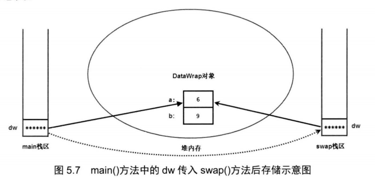

## 5.2方法详解

#### 5.2.2 方法的参数传递机制

>Java 里方法的参数传递方式只有一种：**值传递**

---

Java 对于引用类型的参数传递， 样采用的是值传递方式。

但许多初学者可能对引用类型的参数传递会产生一些误会。下面程序示范了引用类型的参数传递的效果。

> 由于传递的是地址，所以能对实质进行修改，但是对原来的引用变量无关。

```java
//ReferenceTransferTest.java
class DataWrap
{
    int a;
    int b;
}

public class ReferenceTransferTest
{
    public static void swap(DataWrap dw)
    {
        int tmp = dw.a;
        dw.a = dw.b;
        dw.b = tmp;
        System.out.println("a:"+dw.a+"\nb:"+dw.b);
    }
    public static void main(String[] args)
    {
        DataWrap dw = new DataWrap();
        dw.a = 6;
        dw.b = 9;
        swap(dw);
        System.out.println("a:"+dw.a+"\nb:"+dw.b);
    }
}

/*
运行结果：
a:9
b:6
a:9
b:6
*/
```



#### 5.2.3形参数可变的方法

>在定义方法时， 在最后一个形参的类型后增加三个点(...)，则表明该形参可 接受多个参数值，多个参数值被当成数组传入。

```java
public class Varargs
{
    public static void test(int a,String... books)
    {
        for(String tmp : books)
        {
            System.out.println(tmp);
        }
        System.out.println(a);
    }
    public static void main(String[] args)
    {
        test(5,"你好","今天天气不错");
    }
}
```

**注意：**个数可变的形参只能处于形参列表的**最后**。 也就是说，一个方法中最多只能有**一个**个数可变的形参。

#### 5.2.4递归

> 和C一致

#### 5.2.5方法重载

>同一个类中包含了两个或两个以上方法的方法名相同，但形参列表不同，则被称为方法重载。
>
>与C++一致

