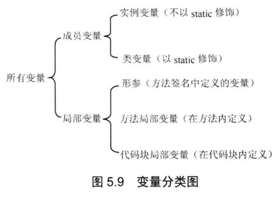

## 5.3成员变量和局部变量

> 根据定义变量位置的不同，可以将变量分成两大类：成员变量和局部变量

> 基本作用域与C++一致

#### 5.3.2 成员变量的初始化和内存中的运行机制

> 在第一次使用某个类时，系统会加载这个类并初始化。之后再创建类对象并为对象分配内存。

#### 5.3.3 局部变量的初始化和内存中的运行机制

> 系统不会为局部变量执行初始化，因此必须显式初始化。
