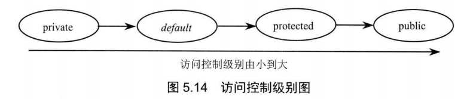
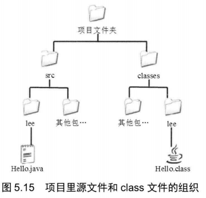
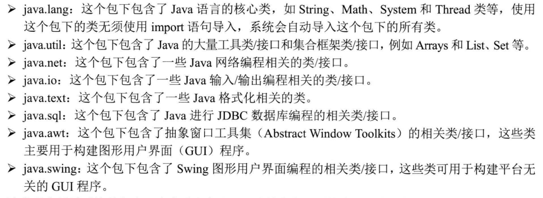

## 5.4隐藏和封装

#### 5.4.2 访问控制符

> Java提供了三种访问控制符：public、private、protected。



* private：该成员只能在当前类的内部进行访问。
* default：该成员能被相同包下的类访问。
* protected：该成员既能被相同包下的类访问，也能被不同包下的子类访问
* public：该成员可以被所有类访问

**注意：**外部类应该只使用public或者default，因为其不存在所在类的概念。

#### 5.4.3package、import和import static

> 在Java文件的第一行，应该写package语句来代表该程序属于哪个包。使用包名来区分两个同名类。（类似C++的名称空间）

```java
package packagename;
```

**案例**

> 程序清单: codes\05\5.4\Hello.java 

```java
package lee; 
public class Hello
{
    public static void main(String[] args)
    {
        System.out.println( "Hello World! ");
    }
}
```

命令：

```shell
javac -d . Hello.java	#在当前目录下生成Hello类
java lee.Hello			#执行lee文件下的Hello文件
```

> 结果：会生成一个lee文件夹，在文件夹中含有Hello.class文件。如果直接使用`javac .\Hello.java`，虽然能编译成功，但是不能正常使用。
>
> 当虚拟机要装载 lee.Hello 类时，它会依次搜索 CLASSPATH 环境变量所指定的系列路径，查找这些路径下是否包含 lee 并在 lee 路径下查找是否包含 Hello .class 文件。

##### 包管理



##### 子包

> 下面代码在 lee 包下再定义一个 sub 子包，并在该包下定义 Apple 空类。

```java
package lee.sub;
public class Apple{}
```

> 使用时，必须使用该类的全名（包名+类名）:`lee.sub.Apple`

```java
lee.sub.Apple a = new lee.sub.Apple();
```

##### 简化包名使用（import）

> 为了简化包名的使用，应当在`package`后使用`import`

```java
import lee.sub.Apple;
```

> 使用import导入指定包的全部类的用法：

```java
import lee.sub.*;
```

##### 静态导入（import static）

> 用于导入指定类的某个静态成员。

```java
import static lee.sub.Apple.staticmembername;
import static lee.sub.Apple.*;
```

#### 5.4.4Java常用包

> Java 的核心类都放在 Java 包以及其子包下， Java 扩展的许多类都放在 Javax 包以及其子包下。




