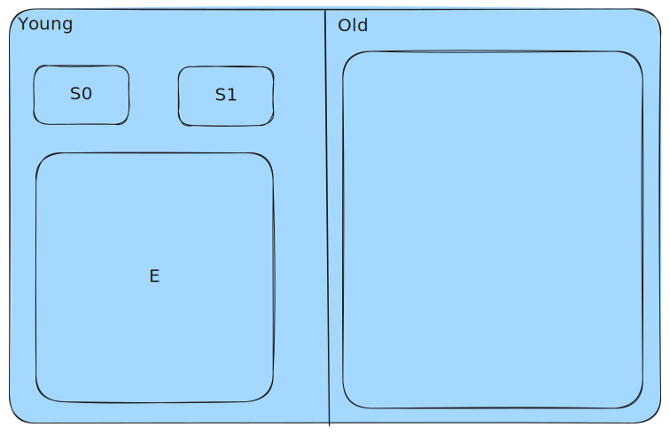

# Java GC

## 常见的GC算法

* 标记-清理：每次从root去遍历每个对象，给对象打上标记，将没有标记的对象清理了
    * 缺点：内存碎片
* 标记-整理：每次从root去遍历每个对象，然后将对象顶到前面空闲的内存处
    * 缺点：代价大，每次都要拷贝所有的对象
* 复制：将内存分为2个区域，每次GC时，都会将对象复制到另一片区域
    * 缺点：2倍内存，拷贝对象

## Java的GC策略

Java的GC有两个区域：

* 新生代（young）：复制算法
    * E区：每次新产生的对象分配到该区域
    * S0和S1区：两个存活区，交替使用，触发Minor GC时发生对象的复制
        * E+S0=>S1
        * E+S1=>S0
    * 占比：`8：1：1`，理由是大多数对象的生命周期都很短
* 老年代（old）：标记-清理算法
    * age>15：当新生代中的对象，age达到15时，进入老年代，此时默认该对象会在很长一段时间内都不会被GC。
    * 大对象：大对象的分配也会放到Old区，因为Young区经常发生GC，每次拷贝大对象的开销比较大。
    * Full GC：old区在快满的时候也会触发GC，成为old gc，由于此时通常会伴随着young gc，因此称为full gc
        * stop the world：full gc会引起stop the world，整个java程序直接暂停，全力GC。
        * 标记-清理/整理：此时GC会采用这两种算法

## 参考资料

* [【java】10分钟，了解GC过程_哔哩哔哩_bilibili](https://www.bilibili.com/video/BV1dt411u7wi/?spm_id_from=333.337.search-card.all.click&vd_source=7ea28e304f19f399517ee153057d1f10)