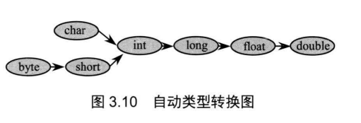

## 3.5基本类型转换

> 不同的类型能进行互相转换。有两种转换方式：自动类型转换和强制类型转换。

#### 3.5.1自动类型转换

> 范围小的类型向大范围的类型转换是自动的。否则是强制的。类似两瓶水，大瓶能自动适应小瓶里的水，但是反过来不行。



```java
//自动类型转换实例
//AutoConversion.java
public class AutoConversion
{
    public static void main(String[] args)
    {
        int a = 6;
        float f = a;
        System.out.println(f);
        
        byte b = 9;
        //char c = b;	出错
        double d = b;
        System.out.println(d);
    }
}

/*
运行结果：
6.0
9.0
*/
```

---

##### 数值自动转字符串

>不仅如此，当把任何基本类型的值和字符串值进行连接运算时，基本类型的值将自动类型转换为字符串类型，虽然字符串类型不是基本类型，而是引用类型 因此 ，如果希望把基本类型的值转换为对应的字符串时，可以把基本类型的值和一个空字符串进行连接。

```java
//PrimitiveAndString.java
public class PrimitiveAndString
{
    public static void main(String[] args)
    {
        //String str1 = 5;	wrong
        String str2 = 3.5f + "";
        System.out.println(str2);
        
        System.out.println(3+4+"Hello");	//7Hello
        System.out.println("Hello"+3+4);	//Hello34
    }
}

/*
运行结果：
3.5
7Hello
Hello34
*/
```

#### 3.5.2强制类型转换

语法格式：`(TargetType)value`

```java
//NarrowConversion.java
public class NarrowConversion
{
    public static void main(String[] args)
    {
        int iValue = 233;
        byte bValue = (byte)iValue;
        System.out.println(bValue);		//-23
        
        double dValue = 3.98;
        int tol = (int)dValue;
        System.out.println(tol);		//3
    }
}

/*
运行结果：
-23
3
*/
```

---

##### 将字符串转换成基本类型

> 在通常情况下，字符串不能直接转换为基本类型，但通过基本类型对应的包装类则可以实现把字符串转换成基本类型。例如，把字符串转换成 int 类型，则可通过如下代码实现:

```java
String a = "45";
int iValue = Integer.parseInt(a);
```

**注意：**Java 种基本类型都提供了对应的包装类: boolean 对应 Boolean，byte对应Byte，short对应Short，int 对应 Integer，long对应Long，char对应Character，float对应Float，double对应Double，每个包装类都提供了parseXxx(String str) 静态方法用于将字符串转换成基本类型。

