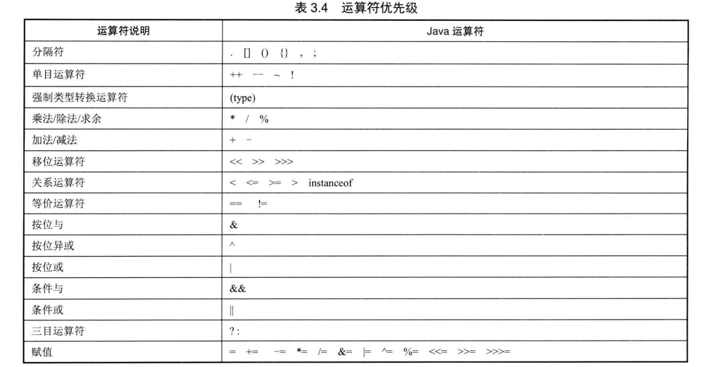
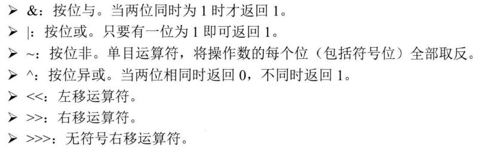
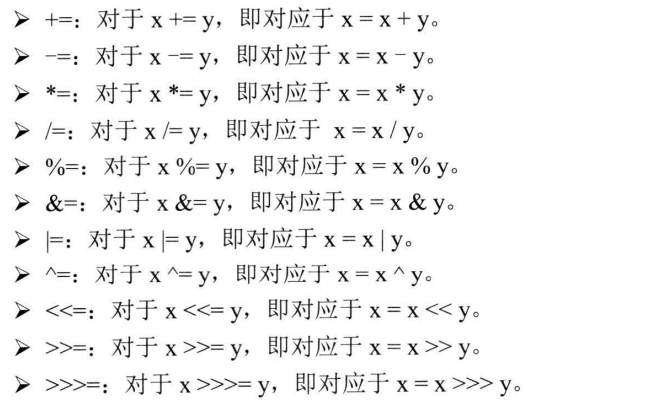
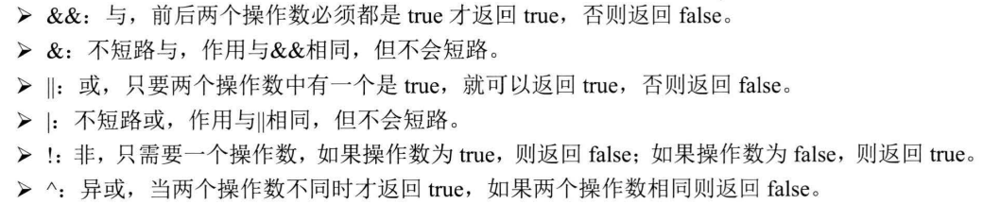

## 3.7运算符



#### 3.7.1算术运算符

**基础**

> 加减乘除。除法注意截断和/0.0（无穷大）。
>
> 求余。%0得到NaN。

**特殊**

> ++，与C相同
>
> --，与C相同

注意：浮点数比较

```java
public class MathTest
{
    public static void main(String[] args)
    {
        double a = 0.3;
        double b = Math.pow(a,5);
        System.out.println(a);
        System.out.println(b);
        double epsinon = 0.00001;
        if((b-0.00243)<epsinon && (0.00243-b)<epsinon)		//允许误差
            System.out.println("eqal success!");
    }
}
```

#### 3.7.2赋值运算符

> 与C一致

#### 3.7.3位运算符



#### 3.7.4扩展赋值运算符



#### 3.7.5比较运算符

> 与C一致

#### 3.7.6逻辑运算符



#### 3.7.7三目运算符

> 与C相同

