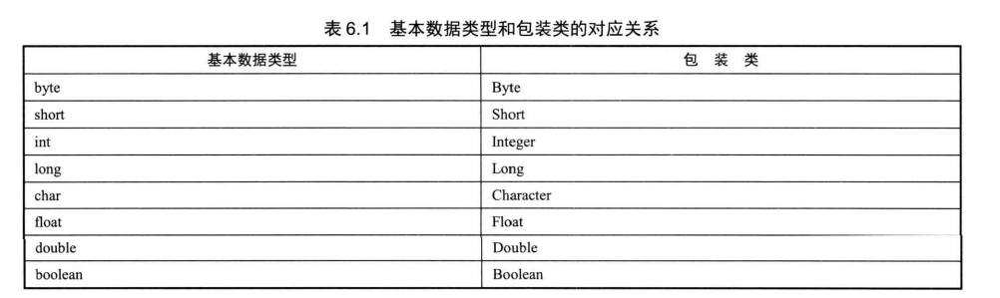

## 6.1Java8增强的包装类



> 为了解决基本数据类型不能被当作Object类型处理，Java8提供了对应的包装类。

#### 6.1.1 自动装箱和自动拆箱

> 在JDK1.5后，java提供自动装箱和自动拆箱功能，即直接用赋值进行转换。（一一对应）

```java
public class AutoBoxingUnboxing
{
    public static void main(String[] args)
    {
        Interger inObj = 5;
        Object boolObj = true;
        int it = inObj;
    }
}
```

#### 6.1.2 包装类的 字符串与数值转换 的静态方法

将字符串类型的值转换为基本类型的值的方法

* 