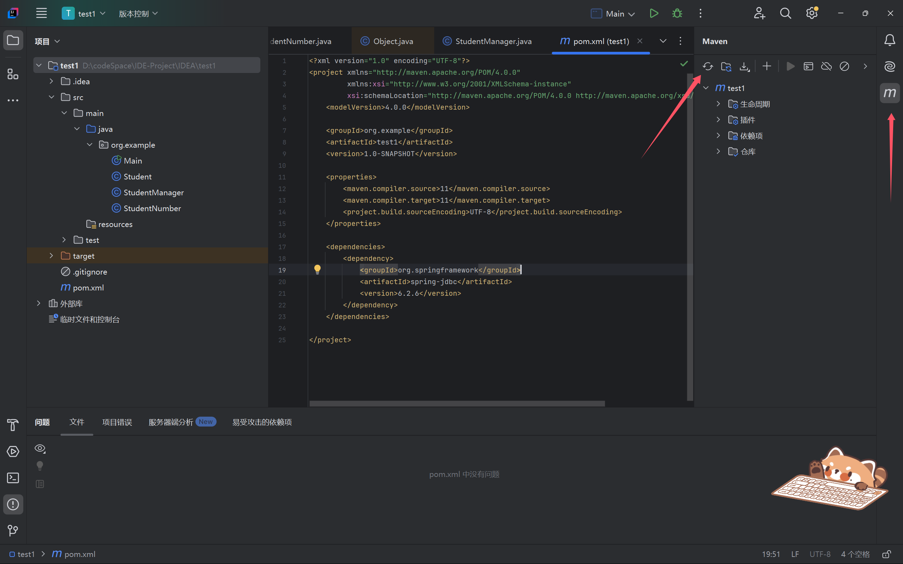
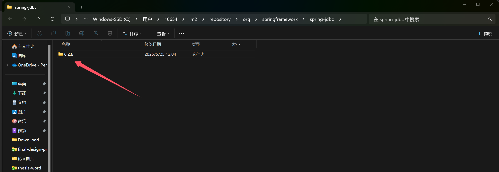
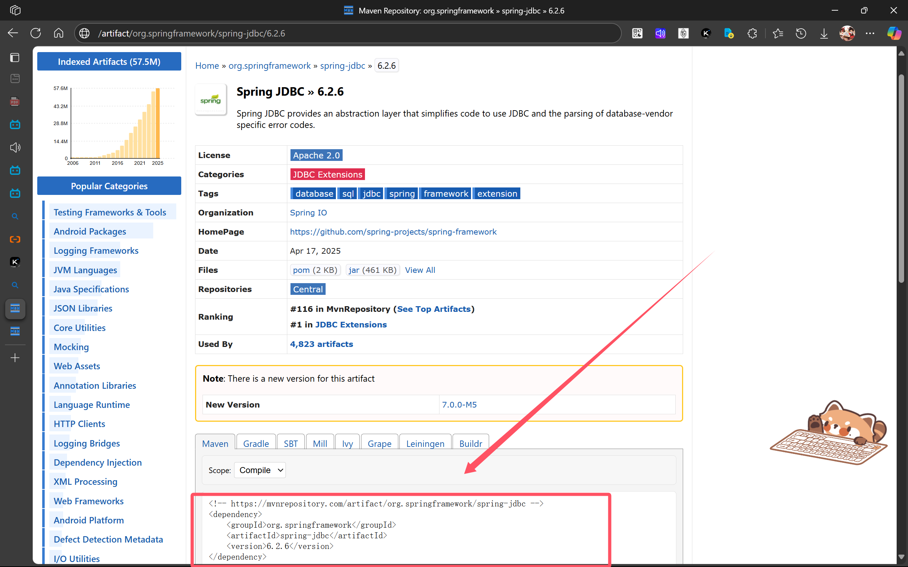

# Maven添加依赖

## 依赖xml

maven添加依赖的方式很简单，在pom.xml里的`dependencies`标签里添加一个依赖坐标：

```xml
<?xml version="1.0" encoding="UTF-8"?>
<project xmlns="http://maven.apache.org/POM/4.0.0"
         xmlns:xsi="http://www.w3.org/2001/XMLSchema-instance"
         xsi:schemaLocation="http://maven.apache.org/POM/4.0.0 http://maven.apache.org/xsd/maven-4.0.0.xsd">
    <modelVersion>4.0.0</modelVersion>

    <groupId>org.example</groupId>
    <artifactId>test1</artifactId>
    <version>1.0-SNAPSHOT</version>

    <properties>
        <maven.compiler.source>11</maven.compiler.source>
        <maven.compiler.target>11</maven.compiler.target>
        <project.build.sourceEncoding>UTF-8</project.build.sourceEncoding>
    </properties>

    <dependencies>
        <dependency>
            <groupId>org.springframework</groupId>
            <artifactId>spring-jdbc</artifactId>
            <version>6.2.6</version>
        </dependency>
    </dependencies>

</project>
```

如果显示找不到依赖，在IDEA中重新刷新一下maven的解析就好，maven会将依赖下载到repo所在的目录：


下载到的目录如图：



## 依赖的坐标

一般maven通过groupId、artifactId和version这三个内容，唯一标识一个依赖。

```xml
<!-- https://mvnrepository.com/artifact/org.springframework/spring-jdbc -->
<dependency>
    <groupId>org.springframework</groupId>
    <artifactId>spring-jdbc</artifactId>
    <version>6.2.6</version>
</dependency>
```

所有的依赖坐标查询，可以在[mvnrespository]([Maven Repository: Search/Browse/Explore](https://mvnrepository.com/))上查询。

