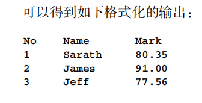

## 1.2在终端中显示输出

#### 1.2.1预备知识

1. **shebang**

> 定义解释该脚本所使用的解释器

```shell
#! /bin/bash	
#如果有，必须在第一行
```

注意：使用该脚本时，可以不指定解释器，但要赋予权限再使用

```shell
chmod a+x sample.sh
./sample.sh

chmod a+x sample.sh ; ./sample.sh	#shell使用分号或者换行符来分隔命令
```

#### 1.2.2实战演练

1. `echo`是终端打印的命令

```shell
echo welcome to bash		#same, a little diff
echo "welcome to bash"
echo 'welcome to bash'

echo "hello!"	#wrong, ! could not be used in ""
echo 'hello!'	#right
echo "hello\!"	#right
```

2. `printf`是另一个命令，与C语言基本一致

```shell
#!/bin/bash
#filename:printf.sh

printf "%-5s %-10s %-4s\n" No Name Mark
printf "%-5s %-10s %-4.2f\n" 1 Sarath 80.3456 
printf "%-5s %-10s %-4.2f\n" 2 James 90.9989 
printf "%-5s %-10s %-4.2f\n" 3 Jeff 77.564
```



#### 1.2.3补充内容

##### 1.echo去除换行

> 默认情况下，echo会在输出文本的尾部追加一个换行符。可以使用选项-n来禁止这种行为。

> 在使用转义序列时，需要使用echo -e  "**包含转义序列的字符串**"这种形式。

```shell
echo -e "1\t2\t3\t"
```

##### 2.打印彩色输出

>脚本可以使用转义序列在终端中生成彩色文本。

见P6