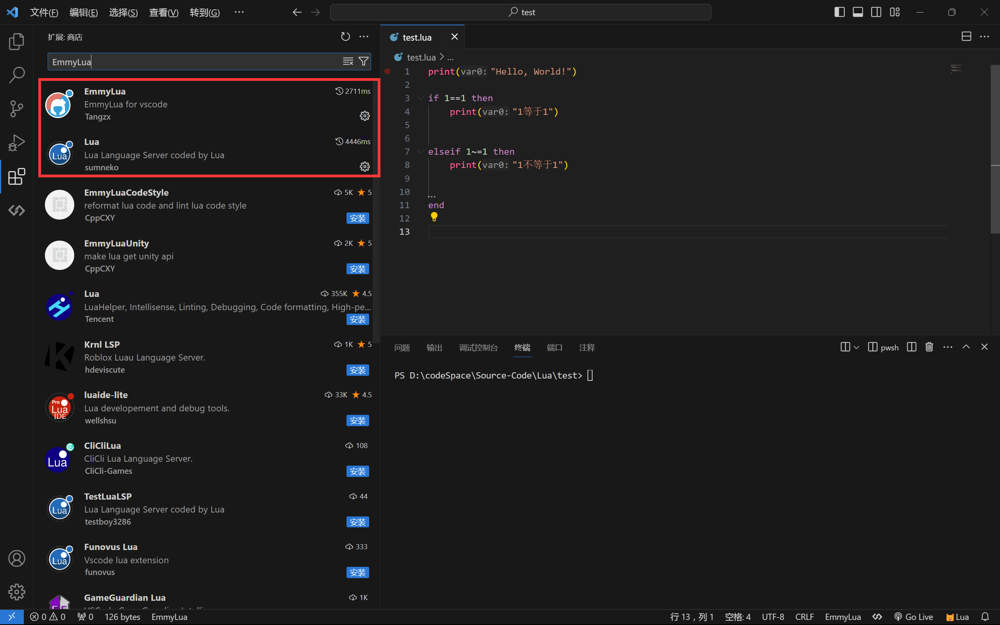

# 00 Lua环境

## 下载Lua

[Lua Binaries Download (sourceforge.net)](https://luabinaries.sourceforge.net/download.html)

## vscode配置

## 参考文献

* [VSCode 配置 Lua 开发环境（清晰明了）_lua vscode-CSDN博客](https://blog.csdn.net/qq_44697754/article/details/133103543)