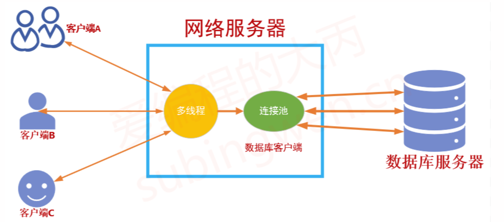

# 01 连接池简介

​	在进行数据库操作的时候为了提高数据库（关系型数据库）的访问瓶颈，除了在服务器端增加缓存服务器（例如redis）缓存常用的数据之外，还可以增加连接池，来提高数据库服务器的访问效率。

## 1 节省的开销

* 建立通信时的TCP三次握手
* 数据库服务器的连接认证
* 关闭连接时的资源回收
* 结束通信时的TCP四次挥手

## 2 连接池的设计

要设计一个数据库连接池，我们需要实现以下几个功能点：

1. 连接池只需要一个实例，所以连接池类应该是一个**单例模式**的类
2. 所有的数据库连接应该维护到一个**安全**的**队列**中
   - 使用队列的目的是方便连接的添加和删除
   - 所谓的安全指的是线程安全，也就是说需要使用互斥锁来保护队列数据的读写。
3. 在需要的时候可以从连接池中得到一个或多个可用的数据库连接
   - 如果有可用连接，直接取出
   - 如果没有可用连接，阻塞等待一定时长然后再重试
4. 如果队列中没有多余的可用连接，需要**动态的创建新连接**
5. 如果队列中空闲的连接太多，需要**动态的销毁一部分**
6. 数据库操作完毕，需要将连接**归还**到连接池中