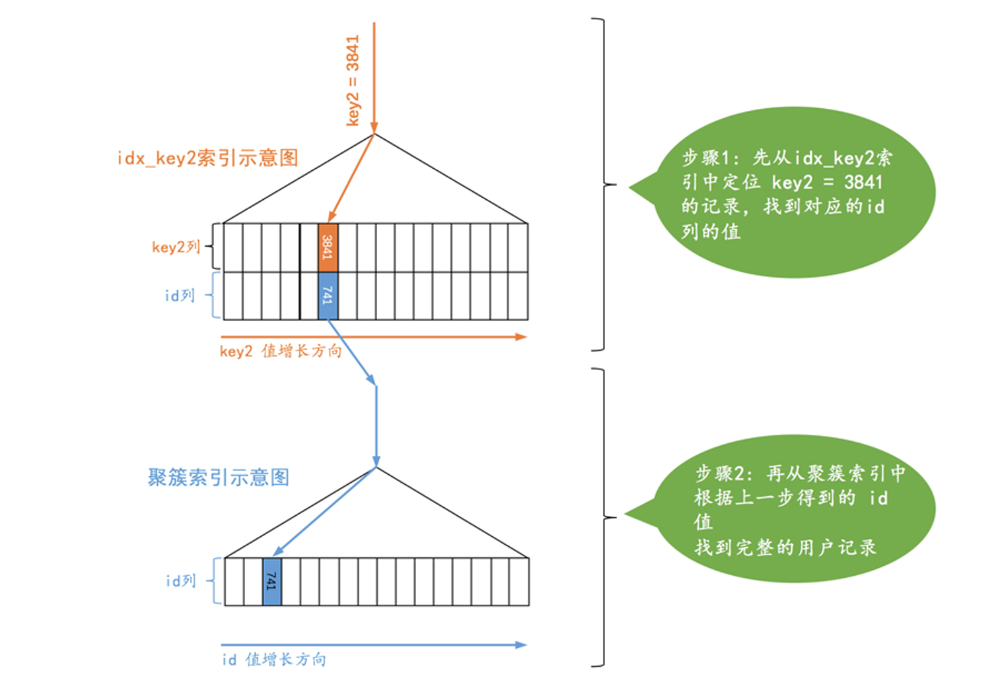
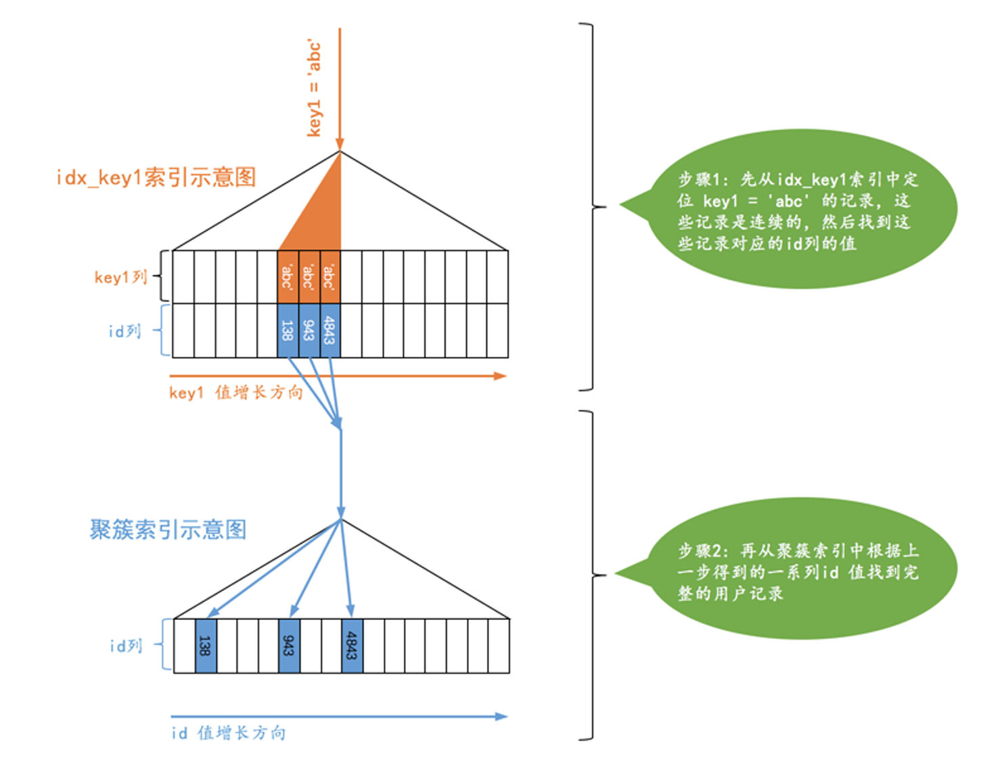
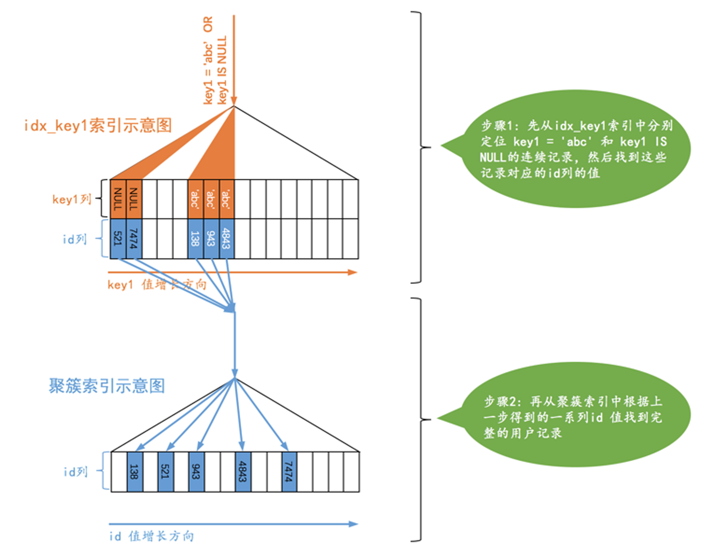
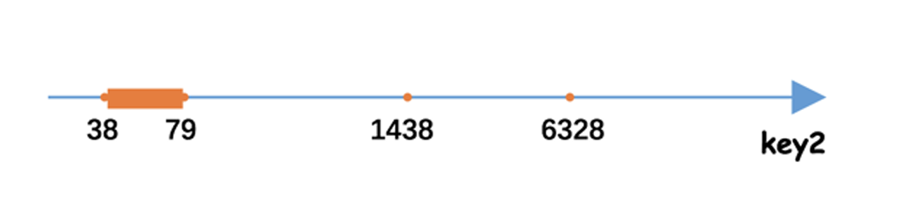

# 访问方法（access method）

## 概念

| 类型        | 概念                                                         | 举例                                                         |
| ----------- | ------------------------------------------------------------ | ------------------------------------------------------------ |
| const       | 通过主键或者唯一二级索引列与常数的等值比较来定位一条记录是像坐火箭一样快的，所以把这种通过主键或者唯一二级索引列来定位一条记录的访问方法定义为：const，意思是常数级别的，代价是可以忽略不计的。 | `SELECT * FROM single_table WHERE key2 = 3841;`              |
| ref         | 搜索条件为二级索引列与常数等值比较，采用二级索引来执行查询的访问方法称为：ref。 | `SELECT * FROM single_table WHERE key1 = 'abc';`             |
| ref_or_null | 在ref的基础上增加对NULL的搜索条件。                          | `SELECT * FROM single_demo WHERE key1 = 'abc' OR key1 IS NULL;` |
| range       | 利用索引进行范围匹配的访问方法称之为：range。                | `SELECT * FROM single_table WHERE key2 IN (1438, 6328) OR (key2 >= 38 AND key2 <= 79);` |
| index       | 采用只遍历二级索引/联合索引记录的执行方式称之为：index（即二级/联合索引记录了足够所需的信息） | `SELECT key_part1, key_part2, key_part3 FROM single_table WHERE key_part2 = 'abc';` |
| all         | 全表扫描                                                     | `SELECT * FROM single_table WHERE key1 = 'abc' AND key2 > 1000;` |

## 图示

| 类型        | 图示                                                         | 特点                                                         |
| ----------- | ------------------------------------------------------------ | ------------------------------------------------------------ |
| const       |  | 通过唯一索引等值查询                                         |
| ref         |  | 通过不唯一索引等值查询                                       |
| ref_or_null |  | 通过不唯一索引等值查询 +NULL查询                        |
| range       |  | 通过索引进行范围查询 需要**比较全表扫描与range+回表**的成本 |
| index       |                                                              | 查询的列都在二级索引或联合索引中，无需再回表。               |

