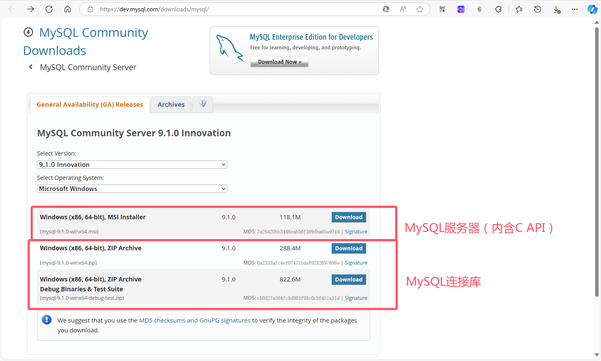

# API库 | 选择

## API库

MySQL官方提供了很多种连接的方式：

### 1. MySQL Connector/C++ API
- **概述**：MySQL Connector/C++ 是一个库，适用于用 C 或 C++ 编写并与 MySQL 数据库服务器通信的应用程序。
- **API类型**：Connector/C++ 版本 9 实现了三种不同的 API：
  - X DevAPI：适用于用 C++ 编写的应用程序。
  - X DevAPI for C：用于用纯 C 编写的应用程序。
  - 基于 JDBC4 的经典 API：也在连接器的早期版本中实现。
- **X DevAPI 特点**：X DevAPI 和 X DevAPI for C 允许访问实施文档存储的 MySQL。在内部，这些 API 使用 X 协议与 MySQL 服务器通信，因此只能与 MySQL Server 8 或更高版本一起使用。

### 2. MySQL C API
- **概述**：MySQL C API 提供对 MySQL 客户端/服务器协议的低级访问，并使 C 程序能够访问数据库内容。C API 代码随 MySQL 一起分发。例如在`mysql-8.1.0-winx64`下的`include`中。
- **API说明**：这种API是C类型的较为底层的API。能实现非常精确的控制，但是使用起来比较低级。详细可以看**Mysql连接池**一文。

## 选择API库

如果选择第一种方式，可以通过下载mysql的连接库，或者使用vcpkg去安装集成到项目。

如果选择第二种方式，可以通过下载mysql的服务端，里面就有对应的C API。

* 下载地址：[MySQL :: Download MySQL Community Server](https://dev.mysql.com/downloads/mysql/)