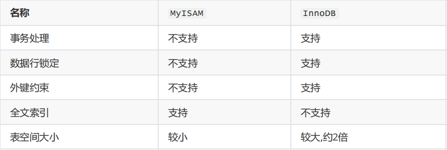

## 数据表类型

`MySQL` 中的数据表类型有许多，如 `MyISAM` 、 `InnoDB` 、 `HEAP` 、 `BOB` 、 `CSV` 等。其中最常用的就是

`MyISAM` 和 `InnoDB`。

#### 1.MyISAM与InnoDB的区别

**如何选择**：当涉及的业务操作以查询居多，修改和删除较少时，可以使用MyISAM。当涉及的业务操作经常会有修改和删除操作时，使用InnoDB。

