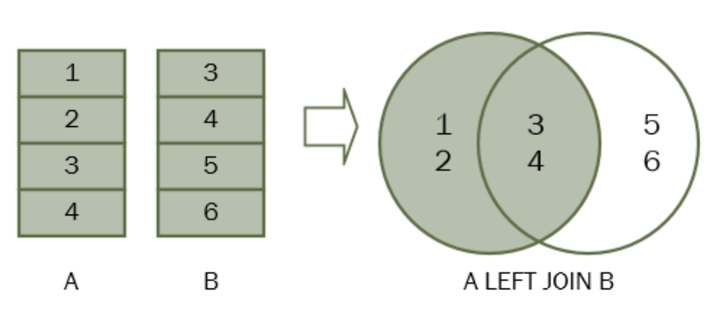

# Inner Join与Left Join/Right Join之间的区别

一直没搞懂这三者之间的区别，用的时候只知道用left join。这两天突然想到，查了一下，发现虽然都是取笛卡尔积，但是只有inner join是才是真正的交集。

而left join在左边表中，找不到右边匹配的行也会显示出来，只是右边相关数据展示为NULL。

```sql
SELECT
    c.country_name, c.country_id, l.country_id, l.street_address, l.city
FROM
    countries c
LEFT JOIN locations l ON l.country_id = c.country_id
WHERE
    c.country_id IN ('US', 'UK', 'CN')

+---------------+------------+------------+-------------------------+------------+
| country_name  | country_id | l.country_id | street_address        | city   	 |
+---------------+------------+------------+-------------------------+------------+
| 美国          | US         | US         | 2014 Jabberwocky Rd     | Southlake  |
| 美国          | US         | US         | 2011 Interios Blvd      | South San Francisco 
| 美国          | US         | US         | 2004 Charade Rd         | Seattle    |
| 英国          | UK         | UK         | 8204 Arthur St          | London     |
| 英国          | UK         | UK         | Magdalen Centre, The Oxford Science Park | Oxford
| 中国          | CN         | NULL       | NULL                    | NULL       |
+---------------+------------+------------+-------------------------+------------+
```

right join同理。



