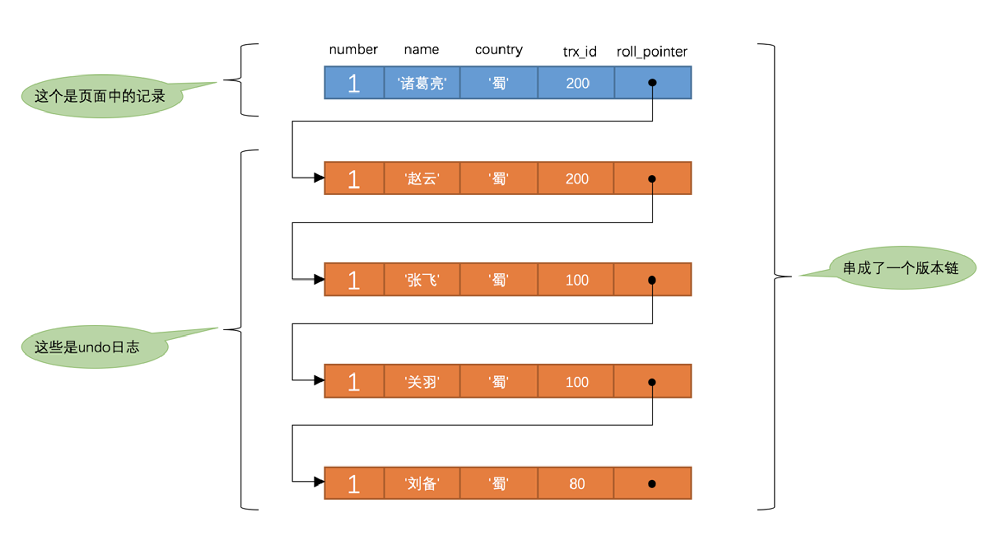

# MVCC原理

MVCC，即多版本并发控制。用于在 读已提交 和 可重复读 的隔离级别中使用。

> 对于使用`READ UNCOMMITTED`隔离级别的事务来说，由于可以读到未提交事务修改过的记录，所以直接读取记录的最新版本就好了；对于使用`SERIALIZABLE`隔离级别的事务来说，所有的事务串行执行，也无需MVCC。

## 版本链

在每个行记录中，都存在两个隐藏的列：

* `trx_id`：每次一个事务对某条聚簇索引记录进行改动时，都会把该事务的事务id赋值给`trx_id`隐藏列。 
* `roll_pointer`：每次对某条聚簇索引记录进行改动时，都会把旧的版本数据写入到 `undo日志` 中，然后这个隐藏列就相当于一个指针，可以通过它来找到该记录修改前的信息。

这里的`roll_pointer`就指向了上一个版本的数据行，从而形成一个单向链表的版本链。

### insert的情况

在插入一条数据时，`roll_pointer`指向一个`insert undo`，用于在事务未完成时进行回滚。在事务完成后这个`insert undo`就会被回收。

### update的情况

在更新数据的时候，`roll_pointer`指向一个undo日志。这个日志就是旧版本的数据，从而形成版本链条。

## 

## read view

>对于使用`READ COMMITTED` 和 `REPEATABLE READ` 隔离级别的事务来说，都必须保证读到已经提交了的事务修改过的记录。也就是说假如另一个事务已经修改了记录但是尚未提交，是不能直接读取最新版本的记录的，核心问题就是：需要判断一下版本链中的哪个版本是当前事务可见的。

### read view中的数据

事务通过`read view`来确认，当前事务可以读取到哪个版本。`read view`中主要包含4个比较重要的内容：

* `m_ids`：表示在生成 `read view`时当前系统中活跃的读写事务的 `事务id` 列表。 
* `min_trx_id`：表示在生成 `read view`时当前系统中活跃的读写事务中最小的 `事务id` ，也就是 `m_ids` 中的最小值。 
* `max_trx_id`：表示生成 `read view`时系统中应该分配给下一个事务的 id 值
* `creator_trx_id`：表示生成该 `read view`的事务的 `事务id` 。

>注意`max_trx_id`并不是m_ids中的最大值，事务id是递增分配的。比方说现在有id为1，2，3这三个事务，之后id为3的事务提交了。那么一个新的读事务在生成`read view`时，m_ids就包括1和2，`min_trx_id`的值就是1，`max_trx_id`的值就是4。

### 如何判断可见性

有了这个`read view` ，这样在访问某条记录时，只需要按照下边的步骤判断记录的某个版本是否可见： 

* 如果被访问版本的`trx_id` 属性值与 `read view`中的 `creator_trx_id` 值相同，意味着当前事务在访问它自己修改过的记录，所以该版本可以被当前事务访问。 
* 如果被访问版本的`trx_id` 属性值小于 `read view`中的 `min_trx_id` 值，表明生成该版本的事务在当前事务生成`read view`前已经提交，所以该版本可以被当前事务访问。 
* 如果被访问版本的`trx_id` 属性值大于 `read view`中的 `max_trx_id` 值，表明生成该版本的事务在当前事务生成`read view`后才开启，所以该版本不可以被当前事务访问。 
* 如果被访问版本的`trx_id` 属性值在 `read view`的 `min_trx_id` 和 `max_trx_id` 之间，那就需要判断一下 `trx_id` 属性值是不是在 `m_ids` 列表中：
    * 如果在，说明创建 `read view`时生成该版本的事务还是活跃的，该版本不可以被访问。
    * 如果不在，说明创建`read view`时生成该版本的事务已经被提交，该版本可以被访问。

### read view什么时候生成

`read view`的生成时机，在`REPEATABLE READ`和`READ COMMITTED`的隔离情况下是不同的：

* `READ COMMITTED`：每次读取数据前都生成一个`read view`
* `REPEATABLE READ`：在第一次读取数据时生成一个`read view`

很显然这是由于这两者的性质决定的：

读已提交情况下，如果外部的事务完成并发生了数据修改，那么我们就应该能读取到这个修改，即使是在同一个事务里。因此每次读取都可以生成一个`read view`。

而可重复读情况下，我们要求对于同一个事务下的数据读取都保持一致，因此在整个事务的期间都保持对外部读到数据的一致性，因此才会只在第一次读取时生成`read view`。