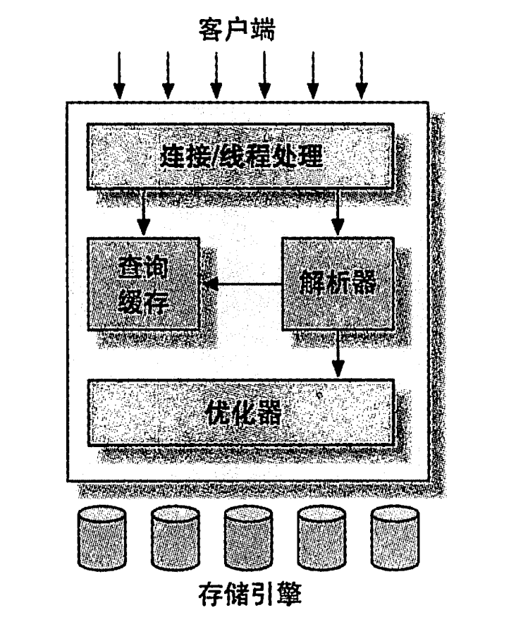

# 1.1 Mysql逻辑架构

[MySQL逻辑架构 - 知乎 (zhihu.com)](https://zhuanlan.zhihu.com/p/416970649)

共有三层架构：

* 连接层：MySQL的最上层是连接服务，引入了线程池的概念，允许多台客户端连接。
  * 主要工作是：**连接处理、授权认证、安全防护等**。
* 服务层：服务层用于处理核心服务，如标准的SQL接口、查询解析、SQL优化和统计、全局的和引擎依赖的缓存与缓冲器等等。
  * 所有的与存储引擎无关的工作，如过程、函数等，都会在这一层来处理。
  * 在该层上，服务器会解析查询并创建相应的内部解析树，并对其完成优化，如确定查询表的顺序，是否利用索引等，最后生成相关的执行操作。
  * 如果是SELECT 语句，服务器还会查询内部的缓存。如果缓存空间足够大，这样在解决大量读操作的环境中能够很好的提升系统的性能。
* 引擎层：存储引擎层，存储引擎负责实际的MySQL数据的**存储与提取，服务器通过API 与 存储引擎进行通信**。不同的存储引擎功能和特性有所不同，这样可以根据实际需要有针对性的使用不同的存储引擎。

## 1.1.1 连接管理与安全性

1. 每个连接都会拥有一个线程，该连接的查询都会在该线程中执行。

2. 连接的的认证基于用户名，原始主机信息和密码。

3. 连接成功后会检查该连接是否具有对某个查询的权限。(例如，是否允许客户端对`world`数据库的`Country`表执行`SELECT`语句)

## 1.1.2 优化与执行

> 对于一个查询，Mysql会在解析器中创建解析树对其进行解析，在优化器中对该查询进行优化。（例如：重写查询，决定表的读取顺序，选择合适的索引等）
>
> 在解析`SELECT`之前，`MySQL`会检查`Query Cache`，如果有相同的结果，直接返回结果集。

用户可以对**优化器**操作：

1. 使用特定关键字提示优化器影响优化过程
2. 请求优化器解释优化过程的各个因素（便于重构查询和schema，修改配置等）

---

​	优化器并不关心使用的存储引擎是什么，但是不同的存储引擎会影响优化后的效果。

