## 在程序开头添加对话框

#### 1.使用LordPE修改PE文件的属性

* 使用LordPE打开PE文件：

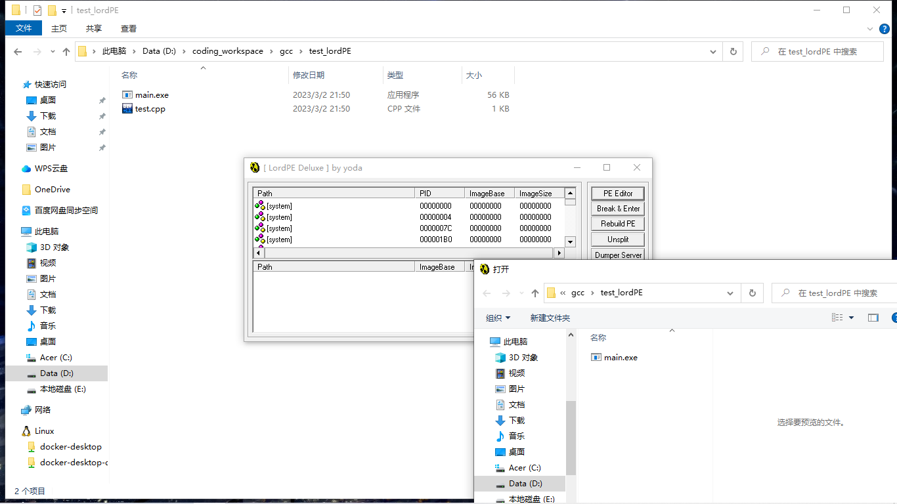

* 打开分区

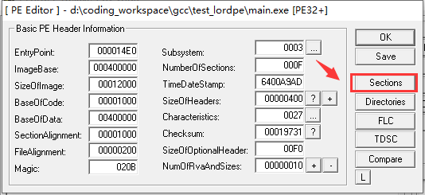

* add new Section header

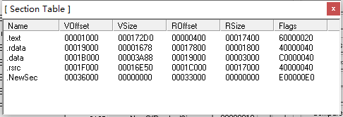

* edit the new Section header
	* VOffset：该Section映射在虚拟内存中的地址
	* VSize：该Section映射在虚拟内存中的长度
	* ROffset：该文件的

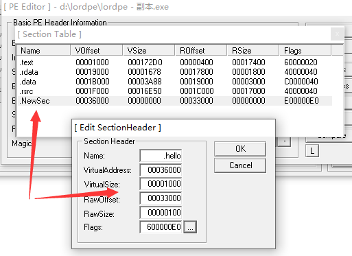

* 修改文件大小属性

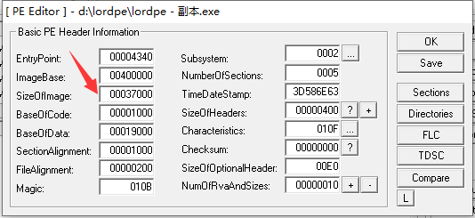

#### 2.使用C32Asm为文件增加size

* 将PE文件拖入应用（十六进制模式）
* 来到文件最后，点击最后的数据，然后点击编辑——插入数据，插入0x200大小，即512

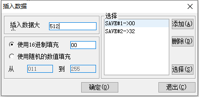

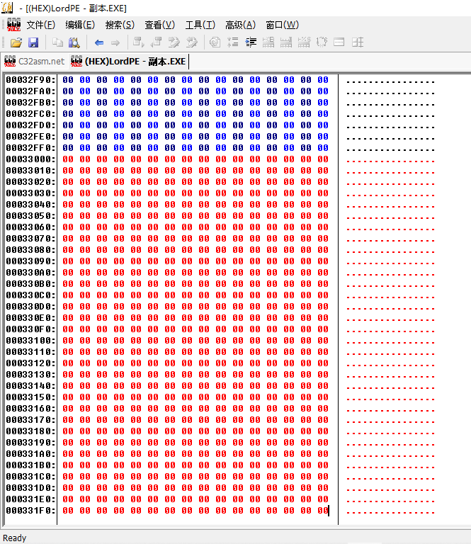

* 保存

#### 3.使用OD注入对话框代码（在此之前使用LordPE修改PE入口点地址）

* 使用OD打开PE文件，可以看到入口点地址（虚拟地址0x404340）( = ImageBase + EntryPoint)

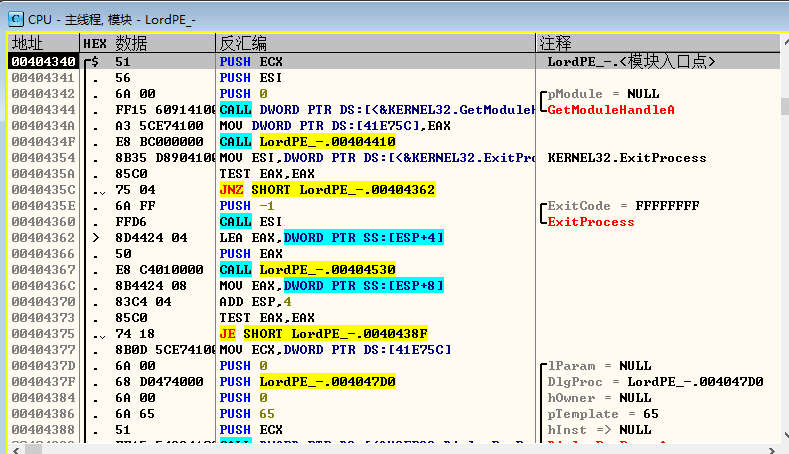

* 使用LordPE修改入口点地址为新增Section地址

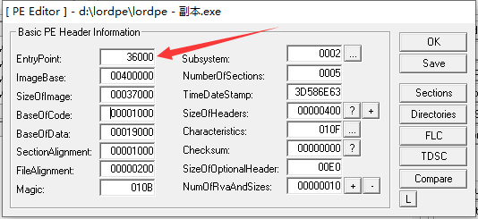

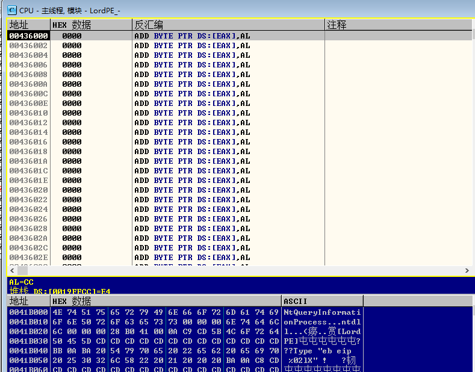

* 使用ctrl+G转到地址0x00436020，选中第一行，按下空格，输入Hello World!!
* 再选中第二行，输入Hello

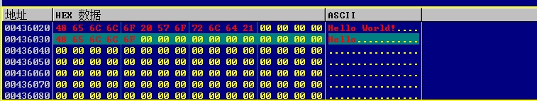

* 在0x436000处，修改汇编代码

```commonlisp
push 0
push 436030
push 436020
push 0
call MessageBoxA
jmp 404340
```

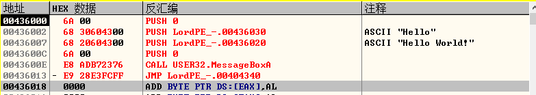

* 选中修改的区域，右击，复制到可执行文件——选择

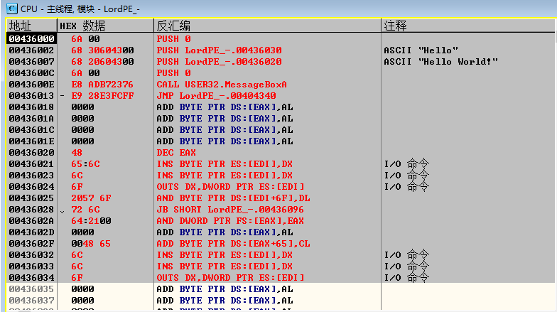

* 在打开的文件窗口中右击——保存文件——覆盖