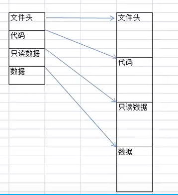

## PE文件结构概述

#### 1.PE文件在内存中和磁盘中的映射关系（磁盘->内存）

#### 2.PE文件的结构概览

* DOS头
* DOS Stub Program
* PE头
  * PE标识
  * 文件头
  * 可选头
* 区块

图解详见：[(23条消息) PE文件结构详解 --（完整版）_pe结构_擒贼先擒王的博客-CSDN博客](https://blog.csdn.net/freeking101/article/details/102752048)