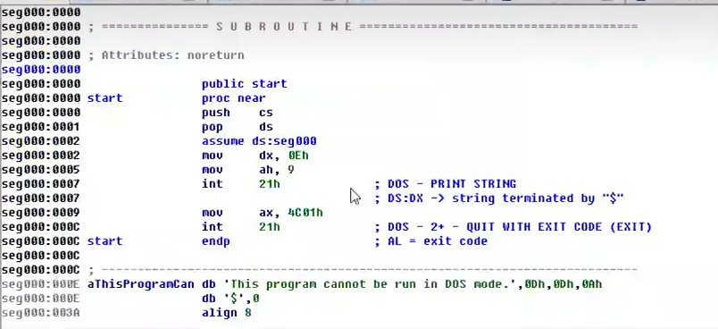

## DOS头详解

DOS头是PE文件结构中的第一个头，用来保持对DOS系统的兼容，并且用于定位真正的PE头。

#### 1.winnt.h

> 在该头文件中定义了DOS头的结构体，大小为40h，64d

```C++
//<winnt.h>
typedef struct _IMAGE_DOS_HEADER {      // DOS .EXE header
    WORD   e_magic;                     // Magic number
    WORD   e_cblp;                      // Bytes on last page of file
    WORD   e_cp;                        // Pages in file
    WORD   e_crlc;                      // Relocations
    WORD   e_cparhdr;                   // Size of header in paragraphs
    WORD   e_minalloc;                  // Minimum extra paragraphs needed
    WORD   e_maxalloc;                  // Maximum extra paragraphs needed
    WORD   e_ss;                        // Initial (relative) SS value
    WORD   e_sp;                        // Initial SP value
    WORD   e_csum;                      // Checksum
    WORD   e_ip;                        // Initial IP value
    WORD   e_cs;                        // Initial (relative) CS value
    WORD   e_lfarlc;                    // File address of relocation table
    WORD   e_ovno;                      // Overlay number
    WORD   e_res[4];                    // Reserved words
    WORD   e_oemid;                     // OEM identifier (for e_oeminfo)
    WORD   e_oeminfo;                   // OEM information; e_oemid specific
    WORD   e_res2[10];                  // Reserved words
    LONG   e_lfanew;                    // File address of new exe header
  } IMAGE_DOS_HEADER, *PIMAGE_DOS_HEADER;
```

其中，只关心两个属性`e_magic`和`e_lfanew`。

* e_magic标志了是否是一个EXE，大小为两个字节：如果是MZ（十六进制为4D 5A），则为EXE。
* e_lfanew记录了PE头相对于文件基址的偏移地址，大小为四个字节：

#### 2.DOS头和DOS Stub Program部分

DOS头中，除了e_magic和e_lfanew，其余数据都只是填充使用。在DOS下的程序如下：



只输出一个"This is program cannot be run in DOS mode."，就退出程序。****

