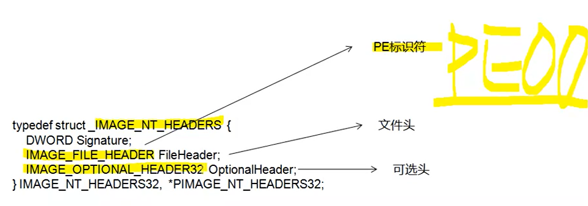

## 文件头及编程解析



> 本节内容为文件头

#### 1.文件头结构体内容

> 该结构体用于判断文件是EXE还是DLL

```C++
typedef struct _IMAGE_FILE_HEADER {
    WORD    Machine;				//运行平台
    WORD    NumberOfSections;		//PE中节的数量，最大96
    DWORD   TimeDateStamp;			//编译器创建该文件的时间戳
    DWORD   PointerToSymbolTable;	//指向符号表（用于调试）
    DWORD   NumberOfSymbols;		//符号表中的符号数量
    WORD    SizeOfOptionalHeader;	//可选头的长度 32:E0/64:F0
    WORD    Characteristics;		//文件属性：exe:010f/dll:210e
} IMAGE_FILE_HEADER, *PIMAGE_FILE_HEADER;
```

> 其它常用取值

```C++
#define IMAGE_SIZEOF_FILE_HEADER 20
//Machine常用取值
#define IMAGE_FILE_MACHINE_I386 0x014C	//Intel 386
#define IMAGE_FILE_MACHINE_IA63 0x0200	//Intel 64

//IMAGE_FILE_HEADER.Characteristics的常用属性(此处取或运算!) :
#define IMAGE_FILE_RELOCS_STRIPPED 0x0001 		// Relocation info stripped from file.
#define IMAGE_FILE_EXECUTABLE_IMAGE 0x0002 		// File is executable (i.e. nounresolved externel references).
#define IMAGE_FILE_LINE_NUMS_STRIPPED 0x0004 	// Line nunbers stripped from file.
#define IMAGE_FILE_LOCALSYMS_STRIPPED 0x0008 // Local symbols stripped from file.
#define IMAGE_FILE_32BIT_MACHINE 0x0100 // 32 bit word machine
#define IMAGE_FILE_SYSTEM 0x1000 // System File.
#define IMAGE_FILE_DLL 0x2000 //File is a DLL.

```

#### 2.使用编程解析文件头

> 由于文件头的大小是固定的，所以比较好解析。不过其中存储了可选头的大小。

```C++
```

