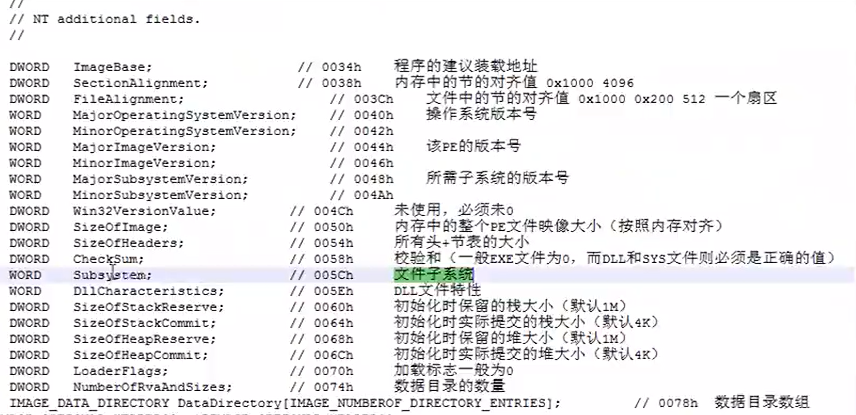

## 可选头及编程解析

> 可选头是IMAGE_OPTIONAL_HEADER，指该结构体的部分数据在不同文件中是不同的。
>
> 由两部分组成：标准字段和增加字段

#### 1.可选头的定义

以下为32位和64位可选头的定义：

```C++
//32
typedef struct _IMAGE_OPTIONAL_HEADER {
    //
    // Standard fields.
    //

    WORD    Magic;
    BYTE    MajorLinkerVersion;
    BYTE    MinorLinkerVersion;
    DWORD   SizeOfCode;
    DWORD   SizeOfInitializedData;
    DWORD   SizeOfUninitializedData;
    DWORD   AddressOfEntryPoint;
    DWORD   BaseOfCode;
    DWORD   BaseOfData;

    //
    // NT additional fields.
    //

    DWORD   ImageBase;
    DWORD   SectionAlignment;
    DWORD   FileAlignment;
    WORD    MajorOperatingSystemVersion;
    WORD    MinorOperatingSystemVersion;
    WORD    MajorImageVersion;
    WORD    MinorImageVersion;
    WORD    MajorSubsystemVersion;
    WORD    MinorSubsystemVersion;
    DWORD   Win32VersionValue;
    DWORD   SizeOfImage;
    DWORD   SizeOfHeaders;
    DWORD   CheckSum;
    WORD    Subsystem;
    WORD    DllCharacteristics;
    DWORD   SizeOfStackReserve;
    DWORD   SizeOfStackCommit;
    DWORD   SizeOfHeapReserve;
    DWORD   SizeOfHeapCommit;
    DWORD   LoaderFlags;
    DWORD   NumberOfRvaAndSizes;
    IMAGE_DATA_DIRECTORY DataDirectory[IMAGE_NUMBEROF_DIRECTORY_ENTRIES];
} IMAGE_OPTIONAL_HEADER32, *PIMAGE_OPTIONAL_HEADER32;

//64
typedef struct _IMAGE_OPTIONAL_HEADER64 {
    WORD        Magic;
    BYTE        MajorLinkerVersion;
    BYTE        MinorLinkerVersion;
    DWORD       SizeOfCode;
    DWORD       SizeOfInitializedData;
    DWORD       SizeOfUninitializedData;
    DWORD       AddressOfEntryPoint;
    DWORD       BaseOfCode;
    ULONGLONG   ImageBase;
    DWORD       SectionAlignment;
    DWORD       FileAlignment;
    WORD        MajorOperatingSystemVersion;
    WORD        MinorOperatingSystemVersion;
    WORD        MajorImageVersion;
    WORD        MinorImageVersion;
    WORD        MajorSubsystemVersion;
    WORD        MinorSubsystemVersion;
    DWORD       Win32VersionValue;
    DWORD       SizeOfImage;
    DWORD       SizeOfHeaders;
    DWORD       CheckSum;
    WORD        Subsystem;
    WORD        DllCharacteristics;
    ULONGLONG   SizeOfStackReserve;
    ULONGLONG   SizeOfStackCommit;
    ULONGLONG   SizeOfHeapReserve;
    ULONGLONG   SizeOfHeapCommit;
    DWORD       LoaderFlags;
    DWORD       NumberOfRvaAndSizes;
    IMAGE_DATA_DIRECTORY DataDirectory[IMAGE_NUMBEROF_DIRECTORY_ENTRIES];
} IMAGE_OPTIONAL_HEADER64, *PIMAGE_OPTIONAL_HEADER64;
```

#### 2.AddressOfEntryPoint和ImageBase的解读

> ImageBase指的是程序的建议装载地址，一般exe文件的装载地址不会被占用。但是dll的装载地址很可能有别的exe加载过，因此将dll的装载地址重定向到另一个地址。
>
> AddressOfEntryPoint指的是程序入口点的相对虚拟地址，其虚拟地址应为ImageBase+AddressOfEntryPoint。

#### 3.32位增加字段的解读



* Subsystem：指示了是命令行程序还是GUI程序（或者其它少见的值）