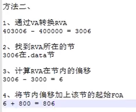

## 节表详解、解析及地址转换

PE中常用三种地址：

* VA：虚拟地址（内存中的地址）
* RVA：相对虚拟地址（内存中的地址相对于起始地址的偏移）
* FOA：文件偏移地址（磁盘中的地址相对于起始地址的偏移）

其它知识：

* 文件对齐size：在磁盘中，一段数据会因为对齐占据的长度
	* 一般为0x1000，或者0x200（一个扇区的大小）
* 内存对齐size：文件从磁盘导入到内存后，一段数据会因为对齐占据的长度
	* 一般为0x1000（一个页的大小）
* 节之间的空白区域：因为各个节在硬盘上是连续的，而在内存中是按页对齐的，所以加载到内存以后节之间会出现一些 “空洞” （见1.2图）。

#### 1.IMAGE_SECTION_HEADER结构体定义

> 有用的加了注释

```C++
typedef struct _IMAGE_SECTION_HEADER {
    BYTE    Name[IMAGE_SIZEOF_SHORT_NAME];		//节名称，最大长度8
    union {
            DWORD   PhysicalAddress;
            DWORD   VirtualSize;				//内存中节区的长度
    } Misc;
    DWORD   VirtualAddress;						//节区的RVA
    DWORD   SizeOfRawData;						//文件对齐后的长度
    DWORD   PointerToRawData;					//该节的FOA
    DWORD   PointerToRelocations;				//
    DWORD   PointerToLinenumbers;
    WORD    NumberOfRelocations;
    WORD    NumberOfLinenumbers;
    DWORD   Characteristics;					//节的属性（取或运算组成）
} IMAGE_SECTION_HEADER, *PIMAGE_SECTION_HEADER;
```

补充：节的属性的宏定义

```C++

//
// Section characteristics.
//
//      IMAGE_SCN_TYPE_REG                   0x00000000  // Reserved.
//      IMAGE_SCN_TYPE_DSECT                 0x00000001  // Reserved.
//      IMAGE_SCN_TYPE_NOLOAD                0x00000002  // Reserved.
//      IMAGE_SCN_TYPE_GROUP                 0x00000004  // Reserved.
#define IMAGE_SCN_TYPE_NO_PAD                0x00000008  // Reserved.
//      IMAGE_SCN_TYPE_COPY                  0x00000010  // Reserved.

#define IMAGE_SCN_CNT_CODE                   0x00000020  // Section contains code.
#define IMAGE_SCN_CNT_INITIALIZED_DATA       0x00000040  // Section contains initialized data.
#define IMAGE_SCN_CNT_UNINITIALIZED_DATA     0x00000080  // Section contains uninitialized data.

#define IMAGE_SCN_LNK_OTHER                  0x00000100  // Reserved.
#define IMAGE_SCN_LNK_INFO                   0x00000200  // Section contains comments or some other type of information.
//      IMAGE_SCN_TYPE_OVER                  0x00000400  // Reserved.
#define IMAGE_SCN_LNK_REMOVE                 0x00000800  // Section contents will not become part of image.
#define IMAGE_SCN_LNK_COMDAT                 0x00001000  // Section contents comdat.
//                                           0x00002000  // Reserved.
//      IMAGE_SCN_MEM_PROTECTED - Obsolete   0x00004000
#define IMAGE_SCN_NO_DEFER_SPEC_EXC          0x00004000  // Reset speculative exceptions handling bits in the TLB entries for this section.
#define IMAGE_SCN_GPREL                      0x00008000  // Section content can be accessed relative to GP
#define IMAGE_SCN_MEM_FARDATA                0x00008000
//      IMAGE_SCN_MEM_SYSHEAP  - Obsolete    0x00010000
#define IMAGE_SCN_MEM_PURGEABLE              0x00020000
#define IMAGE_SCN_MEM_16BIT                  0x00020000
#define IMAGE_SCN_MEM_LOCKED                 0x00040000
#define IMAGE_SCN_MEM_PRELOAD                0x00080000

#define IMAGE_SCN_ALIGN_1BYTES               0x00100000  //
#define IMAGE_SCN_ALIGN_2BYTES               0x00200000  //
#define IMAGE_SCN_ALIGN_4BYTES               0x00300000  //
#define IMAGE_SCN_ALIGN_8BYTES               0x00400000  //
#define IMAGE_SCN_ALIGN_16BYTES              0x00500000  // Default alignment if no others are specified.
#define IMAGE_SCN_ALIGN_32BYTES              0x00600000  //
#define IMAGE_SCN_ALIGN_64BYTES              0x00700000  //
#define IMAGE_SCN_ALIGN_128BYTES             0x00800000  //
#define IMAGE_SCN_ALIGN_256BYTES             0x00900000  //
#define IMAGE_SCN_ALIGN_512BYTES             0x00A00000  //
#define IMAGE_SCN_ALIGN_1024BYTES            0x00B00000  //
#define IMAGE_SCN_ALIGN_2048BYTES            0x00C00000  //
#define IMAGE_SCN_ALIGN_4096BYTES            0x00D00000  //
#define IMAGE_SCN_ALIGN_8192BYTES            0x00E00000  //
// Unused                                    0x00F00000
#define IMAGE_SCN_ALIGN_MASK                 0x00F00000

#define IMAGE_SCN_LNK_NRELOC_OVFL            0x01000000  // Section contains extended relocations.
#define IMAGE_SCN_MEM_DISCARDABLE            0x02000000  // Section can be discarded.
#define IMAGE_SCN_MEM_NOT_CACHED             0x04000000  // Section is not cachable.
#define IMAGE_SCN_MEM_NOT_PAGED              0x08000000  // Section is not pageable.
#define IMAGE_SCN_MEM_SHARED                 0x10000000  // Section is shareable.
#define IMAGE_SCN_MEM_EXECUTE                0x20000000  // Section is executable.
#define IMAGE_SCN_MEM_READ                   0x40000000  // Section is readable.
#define IMAGE_SCN_MEM_WRITE                  0x80000000  // Section is writeable.
```

#### 2.地址转换（根据数据在内存中的地址，转换得到数据在磁盘中的地址）

方法：

* 通过数据的VA得到RVA（即VA-起始VA）
* 找到RVA所在的节号：(RVA/1000)
* 计算RVA在节内的偏移：(RVA-该节的起始RVA)
* 将节内偏移加上该节的起始FOA，完成

---

> 以下是一个案例：数据的起始VA是403006，该文件的起始VA是400000，每个节内存中长度1000，磁盘中长度200。



#### 3.编程实现地址转换

```C++
DWORD RvaToFoa(PIMAGE_NT_HEADERS pImgNtHdr, DWORD dwRva)
{
    DWORD dwFoa = 0;
    //获取节表的起始位置
    PIMAGE_SECTION_HEADER pImgSecHdr = IMAGE_FIRST_SECTION(pImgNtHdr);
    //获取节表的数量
    WORD wNum = pImgNtHdr->FileHeader.NumberOfSections;
    WORD i = 0;
    
    while(i++ < wNum)
    {
        //判断RVA所属的节
        if(dwRva >= pImgSecHdr->VirtualAddress
          && dwRva < pImgSecHdr->VirtualAddress + pImgSecHdr->SizeOfRawData)
        {
            break;
        }
        pImgSecHdr++;
    }
    
    //判断是否找到所处的节
    if(i <= wNum)
    {
        //RVA - 所属节的起始RVA + 所属节的起始FOA
        dwData = dwRva - pImgSecHdr->VirtualAddress + pImgSecHdr->PointToRawData;
    }
    return dwData;
}
```

