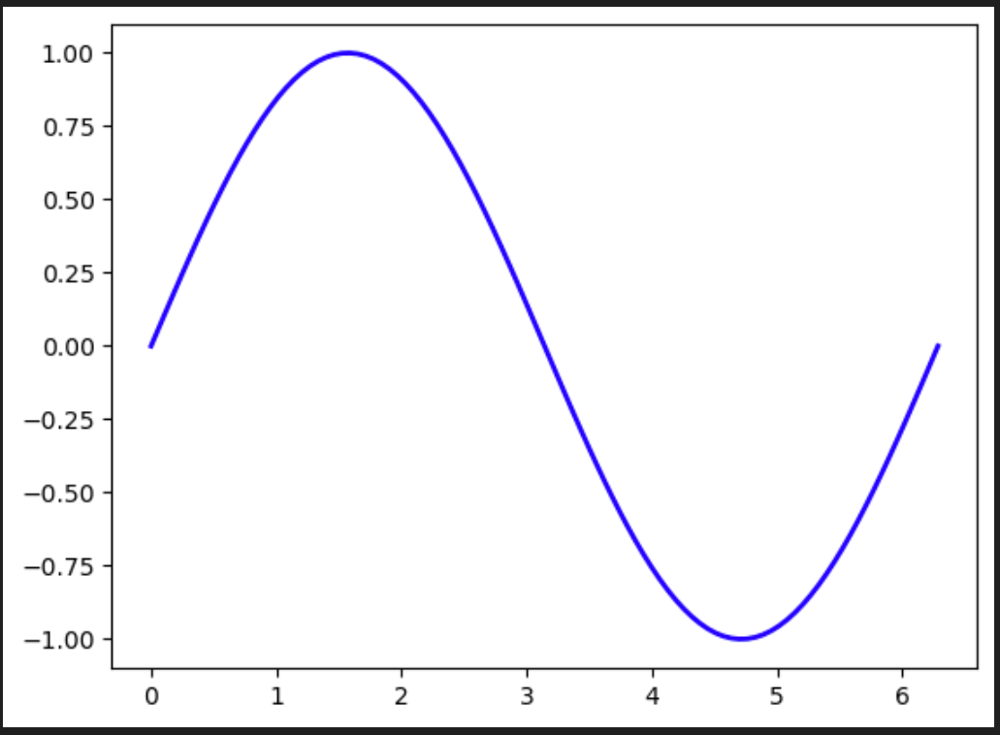
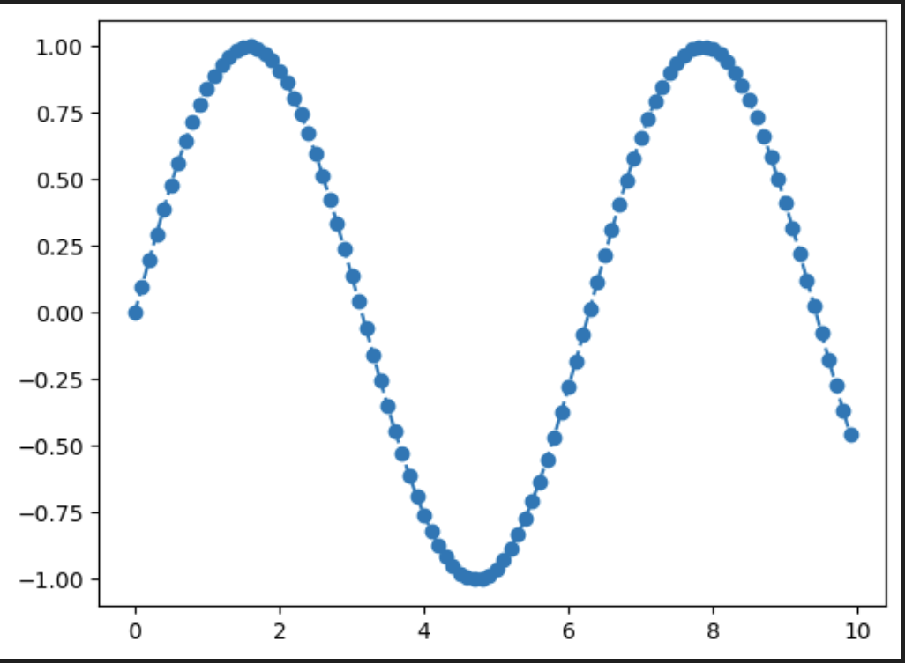
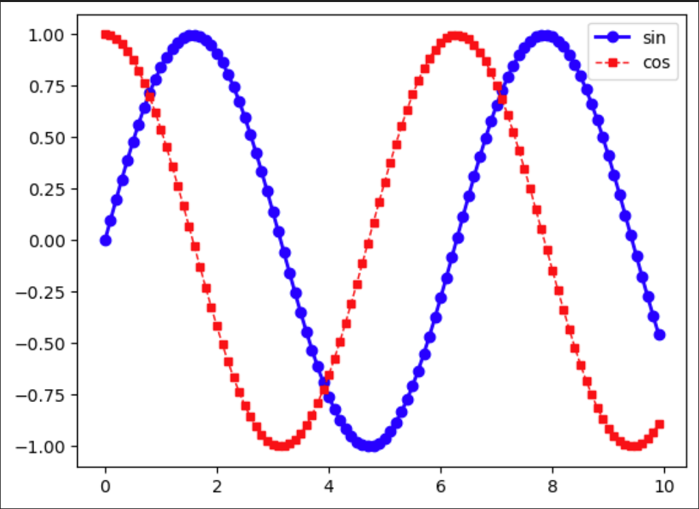

# figure与subplot

## 子图对象ax

```python
import matplotlib as plt

fig, axes = plt.subplots(2,2)	# 2*2子图

# fig, ax = plt.subplots()		# 唯一子图（默认1*1）
# ax.plot(x, y)					# 直接绘制
```

通过`subplots`返回的两个对象：

* figure：全图对象，代表显示出来的一整个图片
* axes：子图矩阵，根据传入的行列划分

```python
# 矩阵方式操作
axes[0, 0].plot([1, 2, 3], [4, 5, 6])
axes[0, 1].plot([1, 2, 3], [6, 5, 4])
axes[1, 0].plot([1, 2, 3], [7, 8, 9])
axes[1, 1].plot([1, 2, 3], [9, 8, 7])

# array方式操作
axes_ = axes.flatten()	# 展开成array，便于操作
axes_[0].plot(sin_y, cos_y)		# 绘制第0张子图
axes_[1].plot(x_array, cos_y)	# 绘制第1张子图
axes_[2].plot(x_array, sin_y)	# 绘制第2张子图
axes_[3].plot(x_array, x_array)	# 绘制第3张子图
```

## 参数使用

### **修改颜色、线宽**

```python
# 创建画布和坐标轴对象
fig, ax = plt.subplots()

# 绘制曲线
ax.plot(x, y, color='blue', linewidth=2)

# 显示图像
plt.show()
```



### **增加marker**

```python
# 生成数据
x = np.arange(0, 10, 0.1)
y = np.sin(x)

# 创建画布和坐标轴对象
fig, ax = plt.subplots()

# 绘制曲线
ax.plot(x, y, linestyle='--', marker='o')

# 显示图像
plt.show()
```



### **两条曲线**（图例）

```python

y1 = np.sin(x)
y2 = np.cos(x)

# 创建画布和坐标轴对象
fig, ax = plt.subplots()

# 绘制曲线
ax.plot(x, y1, color='blue', linewidth=2, linestyle='-', marker='o', markersize=6, label='sin')
ax.plot(x, y2, color='red', linewidth=1, linestyle='--', marker='s', markersize=4, label='cos')

# 设置图例
ax.legend()

# 显示图像
plt.show()

```

