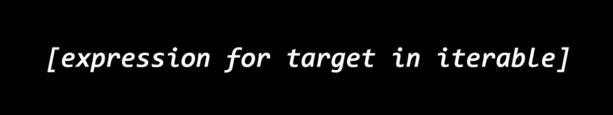
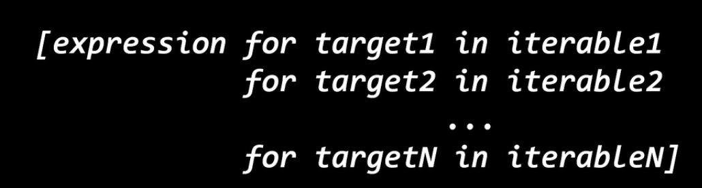
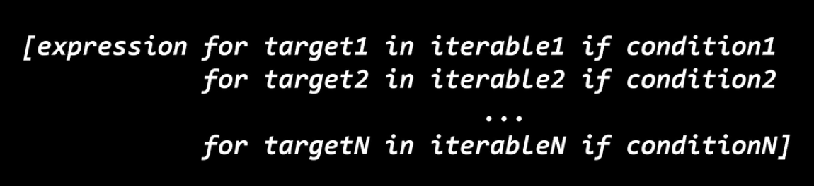

## 列表

#### 1.存在形式：[列表元素]

```python
#例：
[1,2,3,4,5]
#注：这是一个匿名列表，不能再次访问
```

#### 2.变量赋值

```python
#注：列表每个元素的类型可以不同
rmy=[1,2,3,4,5,"上山打老虎"]
```

#### 3.列表遍历

```python
#注：列表本身是个序列
for each in rmy:
    print(each)
```

#### 4.访问列表元素

```python
rmy[0]		#第一个元素
rmy[-1]		#倒数第一个元素
```

#### 5.列表切片

```python
#将列表一部分提取出来作为一个新列表
rmy[0:3]
#[1,2,3]
rmy[3,6]
#[4,5,"上山打老虎"]
rmy[3:]
#第3个至最后
rmy[:3]
#第1个至第3个
rmy[:]
#整个列表
rmy[0:6:2]
rmy[::2]
#跨度为2
rmy[::-1]
#逆序输出
```

#### 6.列表插入

###### 末尾插入

```python
s=[1,2,3,4,5]
s.append(6)#增加一个元素6
s.extend([7,8,9])#增加一个切片
```

```python
s=[1,2,3,4,5]
s[len(s):]=[6]#增加一个元素6
s[len(s):]=[7,8,9]#增加一个切片
```

###### 任意位置

```python
s=[1,3,4,5]
s.insert(1,2)#将2插入到s[1]
```

#### 7.列表删除元素

```python
s=[1,2,3,4,5]
s.remove(1)#删除元素1
#注：
#1.如果有多个相同元素，remove只能删除第一个
#2.如果元素不存在，remove会报错
s.pop(2)#删除下标2的元素
s.clear()#清楚所有元素
```

#### 8.改变列表元素

```python
s=[1,2,3,4,5]
s[3]=10
#将下标为3的元素替换为10
s[3:]=[7,8]
#使用切片将下标3之后的元素替换成新切片
```

#### 9.排序

```python
s=[1,2,34,6,2,1]
s.sort()#从小到大排序（数字）
s.reverse()#反转列表的顺序（将升序变成降序）
```

```python
s=[1,2,34,6,2,1]
s.sort(reverse)#可选参数reverse，效果和上述一致
```

#### 10.查找

```python
s=[1,2,3,3,3,3,4,5,6,7,8]
s.count(3)#查找有几个3
s.index(2)#查找2的索引值
s[s.index(2)]=5#将列表中的2换成5
#注：
#1.index只会返回第一个的索引值
#2.后两个可选参数为start，end用于确认查找范围
```

#### 11.列表拷贝（初步）

```python
s=[1,2,3,3,3,3,4,5,6,7,8]
s1=s.copy()#使用函数
s1=s[:]#切片
#注：
#这些拷贝都是浅拷贝
```

#### 12.列表的运算

##### 加法

```python
s=[1,2,3]
t=[4,5,6]
s+t#将t拼接到s后
```

##### 乘法

```python
s=[1,2,3]
s*3
```

#### 13.嵌套链表

##### 创建

```python
matrix=[[1,2,3],[4,5,6],[7,8,9]]
#另一种
for i in range(3):
    A[i]=[0]*3
#注：这个只是对同一个列表进行3次引用创建的二维列表
```

##### 访问

```python
matrix=[[1,2,3],[4,5,6],[7,8,9]]
for i in matrix:
    for each in i:
        print(each)
        
matrix[0]#[1,2,3]
matrix[0][0]#1

```

#### 14.is运算符

##### 作用：

> 用于检验两个变量是否指向同一个对象的运算符（同一性运算符）

```python
#注意：字符串一样的变量指向同一块内存空间，其余却不是
x = "hello"
y = "hello"
x is y
#True
x = [1,2,3]
y = [1,2,3]
x is y
#False
```


#### 15.浅拷贝与深拷贝

##### 浅拷贝

> 浅拷贝只是拷贝最外层的对象，如果是指针，可能出现不希望发生的引用问题
>
> 深拷贝会将整个对象拷贝过去

**案例**

```python
#浅拷贝
x=[1,2,3]
y=x
#将1，2，3拷贝给y
x=[[1,2,3],[4,5,6],[7,8,9]]
y=x
#将指向三个内层列表的指针拷贝给y
```

```python
#浅拷贝
import copy
x=[[1,2,3],[4,5,6],[7,8,9]]
y=copy.copy(x)		#copy模块的copy函数，不是列表的copy方法！
```

```python
#深拷贝
import copy
x=[[1,2,3],[4,5,6],[7,8,9]]
y=copy.deepcopy(x)		#copy模块的deepcopy函数
```


#### 16.列表推导式

**语法**



```python
#expression:每个元素的表达式
#target：下标
#iterable：可迭代对象
```

**案例**

```python
A=[i for i in range(3)]
A=[i for i in range(3) ...]#此处可加上筛选表达式#
A=[i for i in range(10) if i%2 == 0]
#先执行循环，再执行条件，最后赋值
```

**嵌套**(等价于多层循环嵌套)



**原始式**

