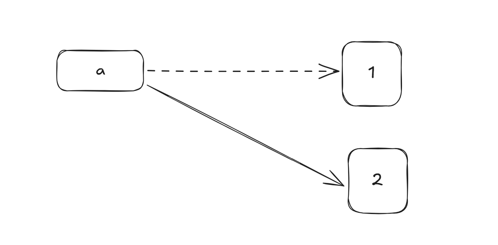
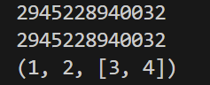
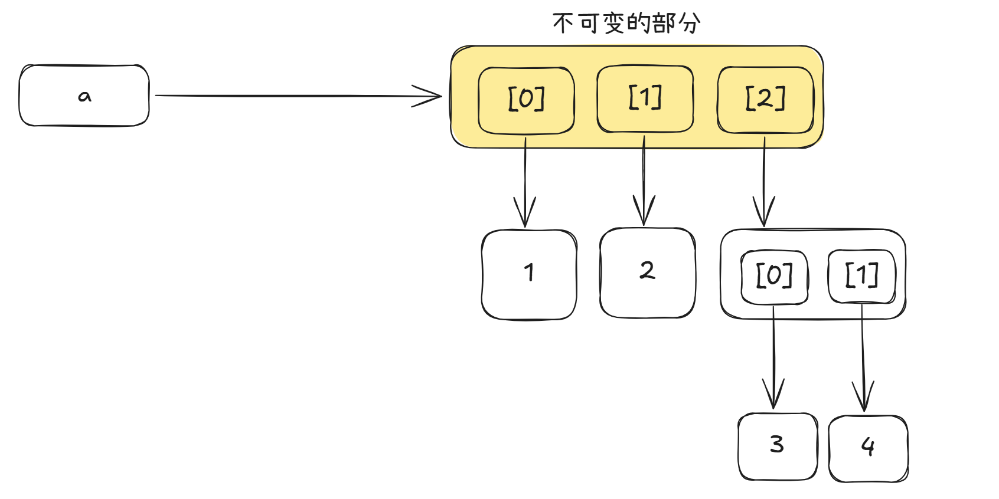

# 可变与不可变

可变与不可变变量，唯一需要记住的就是：它指的是实际内存的属性。

## 不可变：int

对于int而言，其不可变在于，你实际上修改的不是实际的内存，而是创建了一个新的变量：

```python
a = 1
a = a + 1
```



## 不可变：tuple

tuple同样遵循**实际内存不可变**的规律。

如果你觉得违反，一定是你没把Python的对象模型是**一个标签+一个实际内存**搞明白。

```python
a = (1,2,[3])
print(id(a))

a[2].append(4)
print(id(a))
print(a)
```



对于上面这个非常经典的例子，实际上是这样的，tuple的实际内存它确实没有变化：

