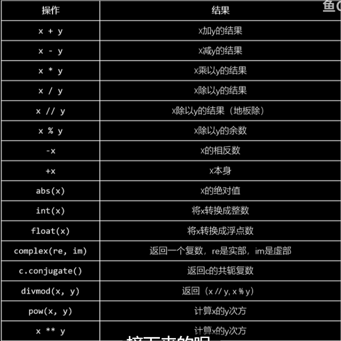
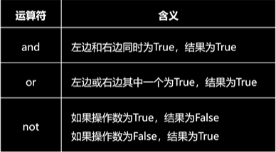
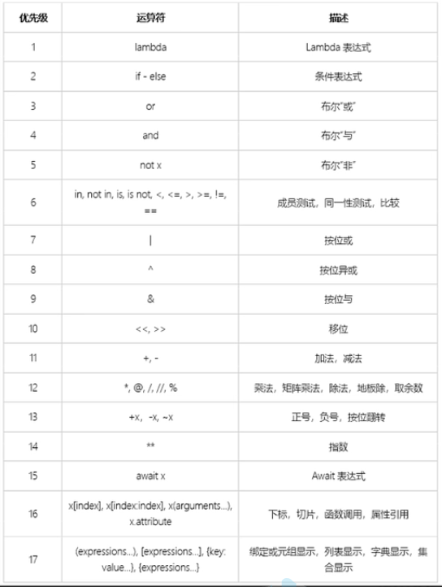

## 数字类型&运算符

### 数字类型

#### 1.整数

> 范围：无限大

> 计算：转换为浮点数计算

> 结果：
>
> 除法：浮点数
>
> 其余：整数

#### 2.浮点数

> 范围：精度有限

```python
a=0.3
if a==0.1+0.2:
    print("yes")
else:
    print("no")
#结果是no,因为0.1+0.2的结果为0.30000000000000004，而a为0.3
```

##### 解决方法(decimal模块)

```python
import decimal
a=decimal.Decimal('0.1')
b=decimal.Decimal('0.2')
print(a+b)
#结果为0.3
```

#### 3.复数

```python
x = 1 + 2j
#1是实部，2j是虚部
#x.real获取实部
#x.imag获取虚部
#以浮点数形式存储
```

#### 4.bool类型

```python
bool(字符串)#只有空字符串才是False，其余都为True
bool(数字)#只有0是False，其余都是True
```


### 运算

#### 算数运算符



###### 注：

> 3/2=1.5
>
> 3//2=1(向下取整)
>
> -3//2=-2(向下取整)

> abs(复数)=复数的模

> int('整数')=整数（‘浮点数’报错）
>
> int(浮点数)=取整


#### 逻辑运算符



##### 注：

> and返回第一个False的表达式的结果，如果都为True，则输出最后那个表达式的结果
>
> or返回第一个True的表达式的结果，如果都为False，则输出最后那个表达式的结果（0）
>
> and和or都遵循短路逻辑
>
> 优先级：not>and>or

```python
3 and 4		#答案是4，原因是3是true，所以将后面的4输出
3 or 4		#答案是3，原因是3是true，所以直接输出前面的3
```


#### 运算符优先级



> 注：运算优先级最高的在下