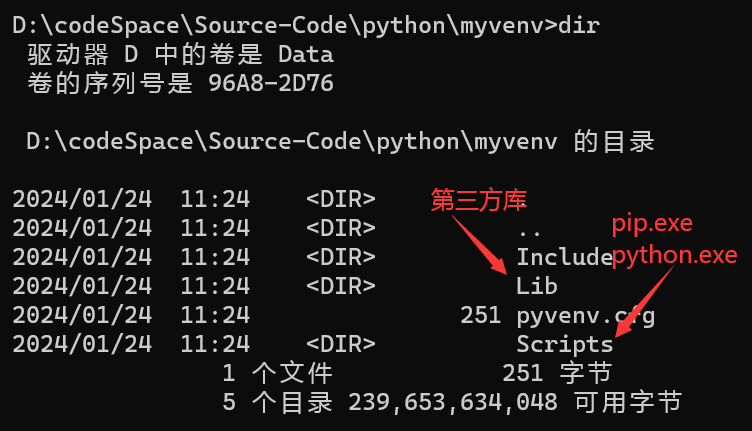
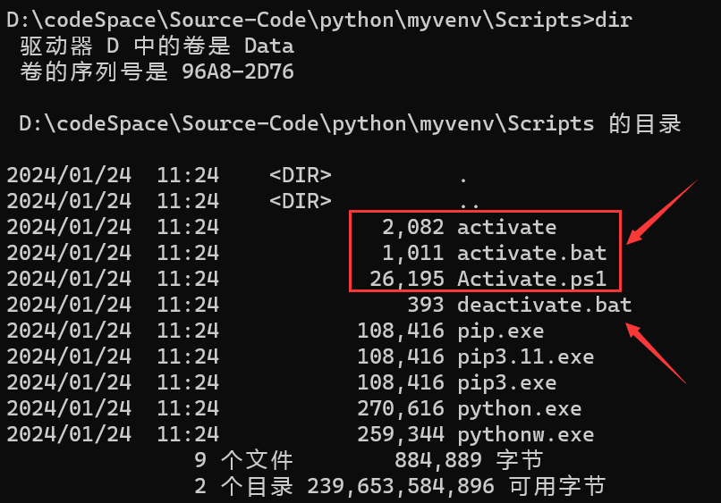
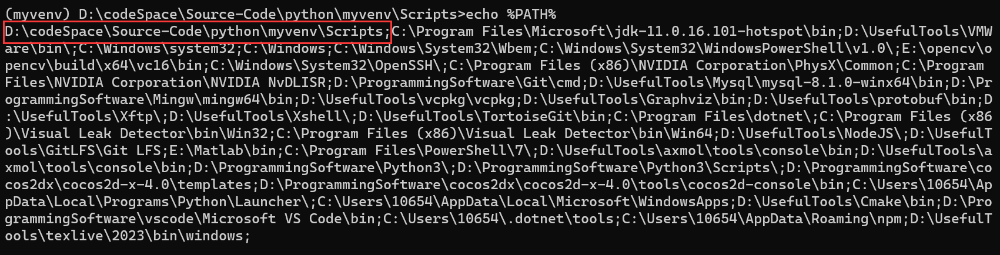
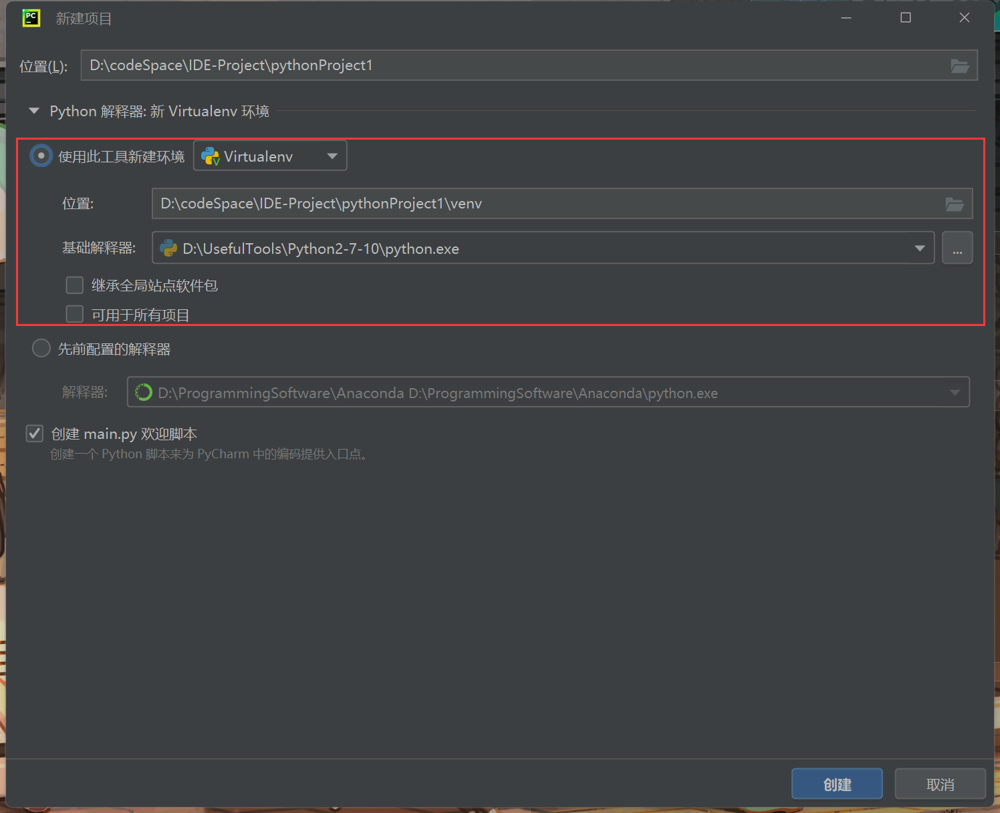

# venv

## 创建（cmd）

​	在对应目录下打开cmd：

```cmd
python -m venv myvenv
```

选项：

* `--system-site-packages`：是否引用真实环境下的包，可以减少包的安装（可能会用到）
* `--without-pip`：不安装pip

安装成功可以看到几个目录：



## 使用与卸载（active）

​	`Script`下的各种Activate脚本，用于不同环境下激活虚拟环境。



​	本质原理在于：在本地的环境变量最前面加上一个参数，用于覆盖后面的python全局参数。



## 创建（pycharm）

### 新建虚拟环境

​	新建项目中，选择虚拟环境：



选项：

* 继承全局站点软件包：即`--system-site-packages`：是否引用真实环境下的包，可以减少包的安装（可能会用到）
* 可用于所有项目：该环境会在下面的“先前配置的解释器”下拉单中出现，便于其它项目共享该环境。

### 使用已经配置好的虚拟环境

​	在新建项目中，选择“先前配置的解释器”，找到虚拟环境目录的Script中的python.exe，选中即可。