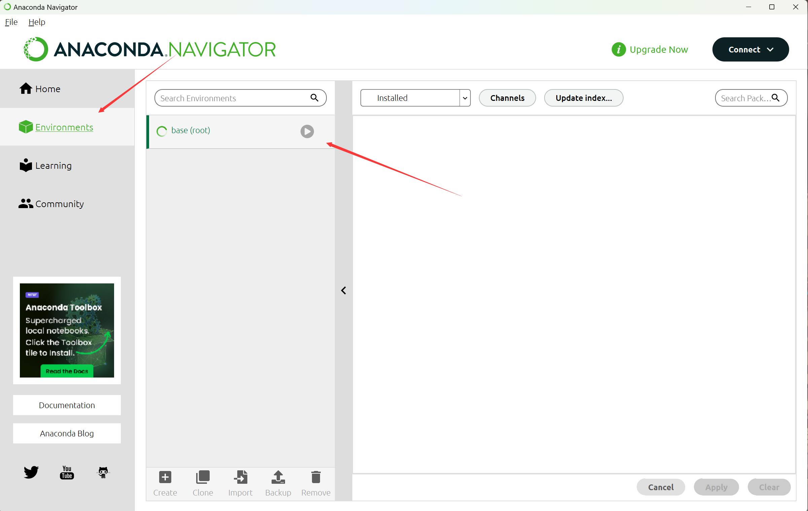
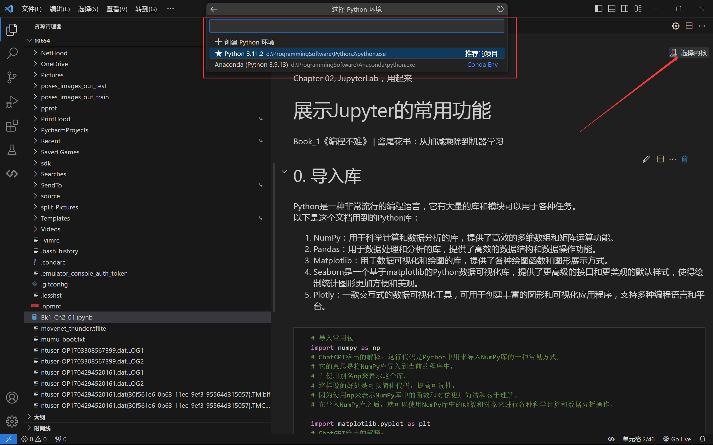

# 03 conda（定制python版本的虚拟环境）

## 创建（cmd）

​	先将conda加入环境变量。使用`conda create`创建

```cmd
conda create -n myenv python=3.8
```

### 激活与卸载

```cmd
conda deactivate myenv

conda deactivate
```

### 查看

```cmd
conda env list
```

​	或者在anaconda中查看：



### 删除

```cmd
conda remove -n myenv --all
```

## 使用（jupyter notebook）

​	jupyter notebook可以选择conda的虚拟环境（左上角），进行运行



## 使用（pycharm）

​	pycharm同理，在python解释器中选择该虚拟环境即可。