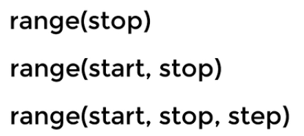

## 条件分支&循环

#### 条件分支

```python
if 条件表达式:
    语句1
    语句2
    语句3
    ...
elif:
    语句1
    语句2
    语句3
    ...
else:
    语句1
    语句2
    语句3
    ...
#注：
#1.条件表达式不用()
#2.属于if/elif/else后执行的语句必须缩进4
```

#### 另一种表达式写法

```python
条件成立时执行的语句if condition else条件不成立时执行的语句
```

> 注：
>
> 该表达式的值是执行语句的值
>
> 该表达式一样可以嵌套在else里

#### 循环

##### while循环

```python
while 条件表达式:
	语句1
    语句2
    语句3
    ...
#注：
#1.条件表达式不用()
#2.属于if/else后执行的语句必须缩进4

break
#注：
#用于循环跳出

continue
#注：
#用于进入下一轮循环

else
#注：
#循环判断错误后进入一次的语句，并结束循环
i=1
while i!=5:
    print("hh")
    i+=1;
else:
    print("stop")    
#输出如下：
hh
hh
hh
hh
stop
```

##### for循环

```python
for 变量 in 可迭代对象:
    语句1
    语句2
    语句3
    ...
else:
    语句1
    语句2
    语句3
    ...
```

> range函数（参数int）
>
> 注：左闭右开



###### 例子：

```python
for i in range(10):
    print(i)
#结果为0~9（换行）
```

