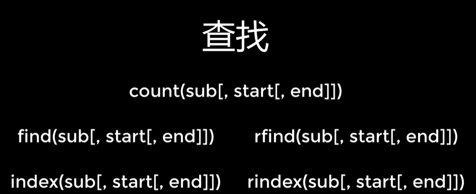
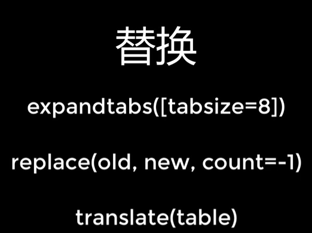
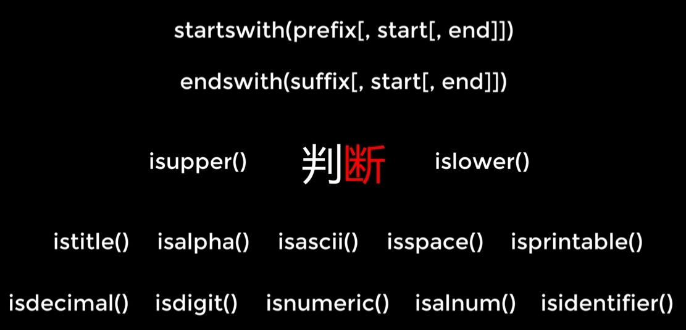
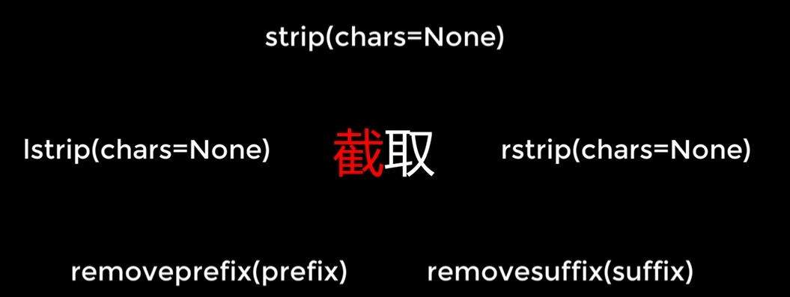
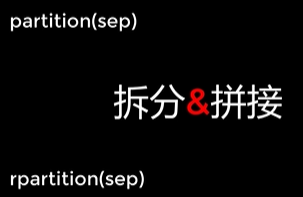

## 字符串

#### 大小写切换方法


```python
x.capitalize()		#对原字符串，生成一个首字符大写，其余小写的字符串
x.casefold()		#对原字符串，生成一个全部小写的字符串
x.title()			#对原字符串，生成一个每个单词首字符大写，其余小写的字符串
x.swapcase()		#大小写翻转
x.upper()			#全改大写
x.lower()			#全改小写
```

#### 左中右对齐


```python
x.center(10)		#中心对齐，width宽度，fillchar（可选）多余的填充字符
x.ljust(10)			#左对齐，width宽度，fillchar（可选）多余的填充字符
x.rjust(10)			#右对齐，width宽度，fillchar（可选）多余的填充字符
x.zfill				#右对齐，width宽度，其余左边的用0填充（数据报表使用）
```

#### 查找



```python
x.count(n,0,6)		#从第1个字符至第5个字符查找n有几个，范围可选
x.find(n,0,6)		#从左往右第1个字符至第5个字符查找第一个n的下标，范围可选，没有返回-1
x.rfind(n,0,6)		#从右往左第1个字符至第5个字符查找第一个n的下标，范围可选，没有返回-1
x.index(n,0,6)		#从左往右第1个字符至第5个字符查找第一个n的下标，范围可选，没有就出现异常
x.rindex(n,0,6)		#从右往左第1个字符至第5个字符查找第一个n的下标，范围可选，没有就出现异常
```

#### 替换



```python
x.expandtabs(4)		#将字符串中所有tab替换成空格，参数为指定一个tab对应的空格数
x.replace("吃饭","睡觉")	#将字符串中需要替换的部分字符串替换掉，最后参数默认-1，表示替换所有

table = str.maketrans("ABCDEFG","1234567")
"I Like FishC".translate(table)
#先制作一个转换规则的表格，再将这个表格导入到需要转换的字符串中
#结果为"I Like 6ish3"
```

#### 判断



```python
x.startswith("我")		#判断字符串的开始是否是指定字符串，返回True/False
x.endswith("我")		#判断字符串的结尾是否是指定字符串，返回True/False

#注：可以提供一个元组来给出多种可能的匹配参数
x.startswith(("我","你","她"))		#判断字符串的开始是否是指定字符串，返回True/False
x.endswith(("我","你","她"))		#判断字符串的结尾是否是指定字符串，返回True/False

x.istitle()			#判断一个字符串中是否所有单词都以大写开头，其余小写
x.isupper()			#判断一个字符串中是否所有单词都是大写
x.islower()			#判断一个字符串中是否所有单词都是小写
x.isalpha()			#判断一个字符串中是否都是字母
x.isspace()			#判断一个字符串中是否都是空白字符
x.isspacetable()	#判断一个字符串中是否都是可打印的字符

x.isdecimal()
x.isdigit()
x.isnumeric()
#以上都是判断字符串是否是数字的，范围从小到大，最小的包含正常数字

x.isidentifier()	#检测一个字符串是否是一个合法的python字符

```

#### 截取



```python
x.lstrip()		#去除字符串的左侧空白
x.rstrip()		#去除字符串的右侧空白
x.strip()		#去除字符串的左右留白
#注：参数默认为空白，可以传入一个字符串，对其中每一个字符进行匹配去除

x.removeprefix("n_")	#删除前缀n_
x.removesuffix(".adj")	#删除后缀.adj

```

#### 拆分&拼接



```python

```

