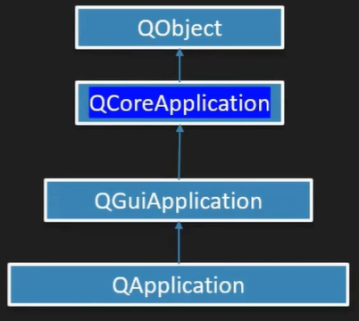
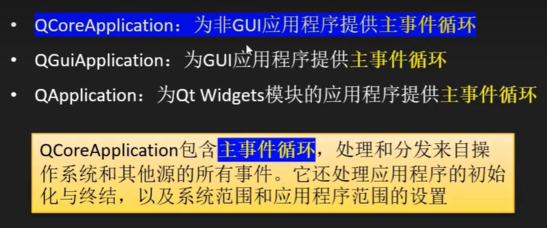

## Qt主事件循环

### 继承结构



#### QCoreApplication



```C++
#include <QApplication>

int main(int argc, char *argv[])
{
    QApplication a(argc, argv);
    qDebug()<<"对象的类名："<<a.metaObject()->className();
    qDebug()<<"应用程序目录："<<a.applicationFilePath();
    a.dumpObjectInfo();
    a.dumpObjectTree();
    return a.exec();			//在这个函数中循环主事件，直到使用exit()才退出
}
```

#### QGuiapplication

> 仅支持操作系统自带的QWindow，功能有限

```c++
#include <QWindow>
#include <QtGui>

int main(int argc, char *argv[])
{
    QGuiApplication a(argc, argv);
    QWindow w;
    w.show();
    qGuiApp->dumpObjectInfo();		//QGuiApp:应用对象的全局指针。仅在应用对象为QGuiApplication才有效
    qGuiApp->dumpObjectTree();
    return a.exec();
}
```

> QWindow的基类是Qobject，并没有QWidget

#### QApplication

> 能为QtWidgets模块的应用程序提供事件循环；在继承QGuiapplication的基础上，还负责初始化QtWidgets模块所需的资源，并提供更多的接口

```c++
#include <QWidget>
#include <QApplication>

int main(int argc, char *argv[])
{
    QApplication a(argc, argv);
    QWidget w;
    w.show();
    qApp->dumpObjectInfo();
    qApp->dumpObjectTree();
    return a.exec();
}
```

