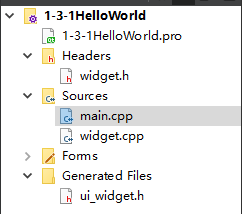
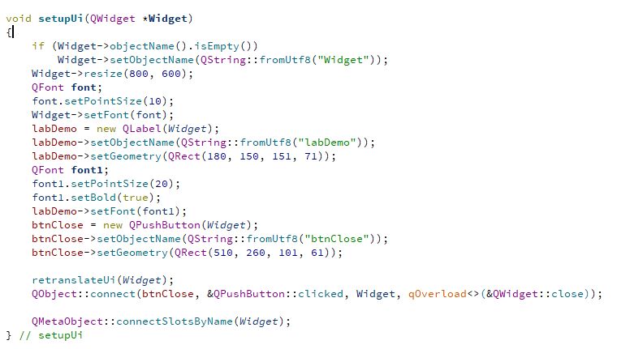
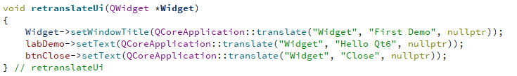
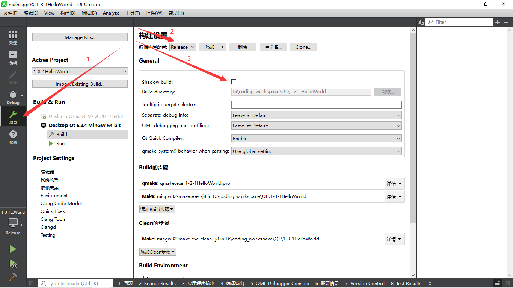

## Qt类文件的组织结构

#### 1.Qt Widget项目基本文件组成

Qt项目中有以下文件：

* widget.h
* widget.cpp
* widget.ui
* ui_widget.h

其中的类的调用关系为：

* `Widget.ui`(ptr)->`Ui::Widget`(from)->`Ui::Ui_Widget`
* `Widget`(from)->`QWidget`

​	其中，Widget是用户程序员使用的主窗口类，内含一个指针，指向`Ui:Widget`（构造时自动new该对象）。`Ui::Widget`是`ui_widget.h`文件中定义的，是一个空类，继承自真正存放了界面设计信息和界面组件的类`Ui::Ui_Widget`，这个类是在设计模块完成后根据设计的内容编译自动生成的类。

#### 2.Ui::Ui_Widget类接口说明

​	这个`Ui::Ui_Widget`类有两个接口：

* setup：
	* 创建界面组件
	* 设置组件属性
	* 设置信号与槽的关联
	* 设置文字（调用retranslateUi）

*  retranslateUi：设置界面上各组件的文字属性，所有和文字相关的设置被集中到这个函数中。在设置多语言界面时会用到这个函数。

​	注意：`Ui::Ui_Widget`只是存放了窗口应该有的信息，但没有继承QWidget类，也就不是一个窗口。真正的窗口还是Widget类。

---

> 在project中，使用release模式并取消build shader选项，就会出现系统编译时构建的中间文件`ui_widget.h`。

