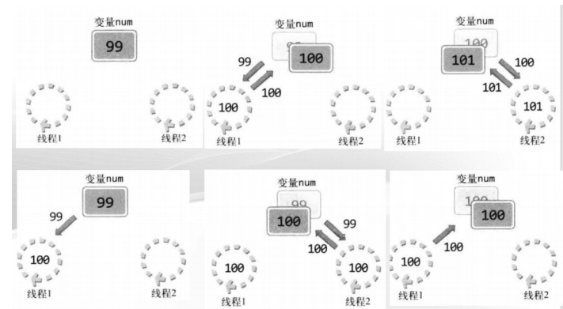

## 从操作系统层面理解线程

#### 补充内容：内核对象

> 1.创建：内核对象通过 API 来创建，每个内核对象是一个数据结构，它对应一块内存，由操作系统内核分配，并且只能由操作系统内核访问。在此数据结构中少数成员如安全描述符和使用计数是所有对象都有的，但其他大多数成员都是不同类型的对象特有的。内核对象的数据结构只能由操作系统提供的 API 访问，应用程序在内存中不能访问。调用创建内核对象的函数后，该函数会返回一个句柄，它标识了所创建的对象。它可以由进程的任何线程使用。
>
> 2.常见的内核对象 : 进程、线程、文件，存取符号对象、事件对象、文件对象、作业对象、互斥对象、管道对象、等待计时器对象，邮件槽对象，信号对象

#### 1.主线程和子线程的声明周期

##### 1.1主线程和子线程的结束时间

* 主线程：在main函数返回时结束
* 子线程：相应函数结束或者在main结束时被强行结束

> 即main函数结束后，整个进程终止，同时终止其包含的所有线程

##### 1.2使用WaitForSingleObject函数来等待一个内核对象变为已通知状态

> 使用该函数，传入相应内核对象的句柄，主线程将阻塞等待该内核对象结束。

参数：

* hHandle：指明内核对象的句柄
* dwMilliseconds：等待时间（通常使用INFINITE宏表示一直等待）

核心代码：

```C++
int wr;
HANDLE hThread = (HANDLE)_beginthreadex(NULL, 0, ThreadFun,(void*)&iParam, 0, &dwThreadID);

if ((wr = WaitForSingleObject(hThread, INFINITE)) == WAIT_FAILED)		//主线程阻塞在此处
{
    puts("thread wait error");
	return -1;
}
```

##### 1.3使用WaitForMultipleObjects函数来等待一组内核对象变为已通知状态（多线程阻塞）

参数：

* nCount：监测的句柄个数
* lpHandles：监测的句柄的数组
* bWaitAll：TRUE表示等待所有的内核对象发出信号， FALSE表示任意一个内核对象发出信号
* dwMilliseconds：等待时间（通常使用INFINITE宏表示一直等待）

**案例**

> 本示例开启50个线程，一半用来对全局变量num++500000次，一半用来对全局变量num--500000次，主线程阻塞等待所有线程执行完毕，才会停止。但是最终num不等于0（线程不同步导致对象被多次引用）



```C++
#include <stdio.h>
#include <windows.h>
#include <process.h>
#define NUM_THREAD 50
unsigned WINAPI threadInc(void* arg);
unsigned WINAPI threadDes(void* arg);
long long num = 0;
int main(int argc, char* argv[])
{
	HANDLE tHandles[NUM_THREAD];
	int i;
	printf("sizeof long long: %d \n", sizeof(long long));
	for (i = 0; i < NUM_THREAD; i++)
	{
		if (i % 2)
			tHandles[i] = (HANDLE)_beginthreadex(NULL, 0, threadInc, NULL, 0, NULL);
		else
			tHandles[i] = (HANDLE)_beginthreadex(NULL, 0, threadDes, NULL, 0, NULL);
	}
	WaitForMultipleObjects(NUM_THREAD, tHandles, TRUE, INFINITE);
	printf("result: %lld \n", num);
	return 0;
}
unsigned WINAPI threadInc(void* arg)
{
	int i;
	for (i = 0; i < 500000; i++)
		num += 1;
	return 0;
}
unsigned WINAPI threadDes(void* arg)
{
	int i;
	for (i = 0; i < 500000; i++)
		num -= 1;
	return 0;
}
```

