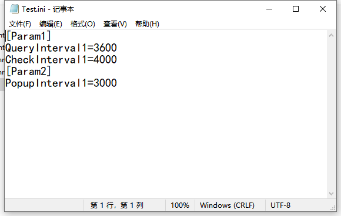

## 配置文件的操作

#### 1.什么是配置文件（.ini文件）

> 一些程序在启动时会加载存储在其配置文件中的信息。同时，其他人会定期检查配置文件以查看其是否已更改。这类允许用户更改配置的文件。

一般以键值对的形式存储在文件中

#### 2.读写配置文件函数

```C++
WritePrivateProfileString();
WritePrivateProfileInt();
...			//允许以多种类型的方式写入配置文件，参数查阅文档
```

##### 1.写配置文件

```C++
char szPath[MAX_PATH] = {0};
GetCurrentDirectory(MAX_PATH,szPath);			//将当前进程所在的目录存到szPath中

char szMyPath[MAX_PATH] = {0};
sprintf(szMyPath, "%s\\Test.ini",szPath);		//将对应的ini文件路径写到szMyPath中

WritePrivateProfileString("Param1","QueryInterval1","3600",szMyPath);	//写入参数
WritePrivateProfileString("Param1","CheckInterval1","4000",szMyPath);
WritePrivateProfileString("Param2","PopupInterval1","3000",szMyPath);
```

结果如下：



##### 2.读配置文件

```C++
char szPath[MAX_PATH] = {0};
GetCurrentDirectory(MAX_PATH,szPath);			//将当前进程所在的目录存到szPath中

char szMyPath[MAX_PATH] = {0};
sprintf(szMyPath, "%s\\Test.ini",szPath);		//将对应的ini文件路径写到szMyPath中

char str1[1024] = {0};
char str2[1024] = {0};
char str3[1024] = {0};

GetPrivateProfileString("Param1","QueryInterval1",NULL,str1,1024,szMyPath);	//获取配置文件参数
GetPrivateProfileString("Param1","CheckInterval1",NULL,str2,1024,szMyPath);
GetPrivateProfileString("Param2","PopupInterval1",NULL,str3,1024,szMyPath);

CString strShow;
strShow.Format("QueryInterval1 = %s, CheckInterval1 = %s, PopupInterval1 = %s",str1,str2,str3);
MessageBox(strShow);
```


