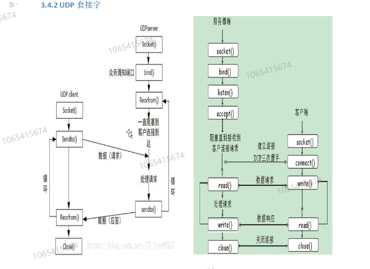

## UDP网络编程服务器

> 与TCP相比，UDP无需listen，服务器直接在recvfrom处阻塞，等待客户端连接



#### 1.初始化网络库

```C++
WORD wVersionRequested;
WSADATA wsadata;
int err;
wVersionRequested = MAKEWORD(2, 2);

err = WSAStartup(wVersionRequested, &wsadata);
if (err)
{
	printf("WSAStartup errnum: %d\n", GetLastError());
	return err;
}

if (LOBYTE(wsadata.wVersion) != 2 || HIBYTE(wsadata.wVersion) != 2)
{
	printf("LOBYTE errnum: %d\n", GetLastError());
	WSACleanup();
	return -1;
}
```

**创建socket**

```C++
SOCKET sockSrv;
sockSrv = socket(AF_INET, SOCK_DGRAM, 0);		//注意，此处使用SOCK_DGRAM，即UDP方式
if (INVALID_SOCKET == sockSrv)
{
	printf("socket err : %d", GetLastError());
	return -1;
}
```

#### 2.bind

```C++
SOCKADDR_IN addrSrv;
addrSrv.sin_addr.S_un.S_addr = htonl(INADDR_ANY);
addrSrv.sin_family = AF_INET;
addrSrv.sin_port = htons(6001);

if (SOCKET_ERROR == bind(sockSrv, (SOCKADDR*)&addrSrv, sizeof(SOCKADDR)))
{
	printf("bind err : %d", GetLastError());
	return -1;
}
```

#### 3.recvfrom和sendto函数

recvfrom参数：

* SOCKET s：服务器SOCKET（不同于TCP：需要创建一个分机SOCKET去处理。UDP直接使用服务器socket本身去接收数据）
* char* buf：接收的缓冲区，一般创建一个固定大小的数组来接收。
* int len：缓冲区的最大长度
* int flags：默认填0
* sockaddr* from：数据来源，与bind时的参数一致，即(SOCKADDR*)&addrSrv
* int* fromlen：地址结构体的大小，且必须是一个指针，提前用len = sizeof(SOCKADDR)求出，再填入len即可。

```C++
SOCKADDR_IN addrCli;
int len = sizeof(SOCKADDR_IN);
char recvBuf[100] = { 0 };
char sendBuf[100] = { 0 };

while (1)
{
	recvfrom(sockSrv, recvBuf, 100, 0, (SOCKADDR*)&addrCli, &len);
	cout << recvBuf << endl;
	sprintf_s(sendBuf, 100, "Ack:%s", recvBuf);	//将接收到的内容直接发回去
	sendto(sockSrv, sendBuf, sizeof(sendBuf) + 1, 0, (SOCKADDR*)&addrCli, len);
}
```


#### 完整代码

```C++
#include<iostream>
#include<WinSock2.h>
using namespace std;

#pragma comment(lib,"ws2_32.lib")

int main()
{
	cout << "Server" << endl;
	WORD wVersionRequested;
	WSADATA wsadata;
	int err;
	wVersionRequested = MAKEWORD(2, 2);

	err = WSAStartup(wVersionRequested, &wsadata);
	if (err)
	{
		printf("WSAStartup errnum: %d\n", GetLastError());
		return err;
	}

	if (LOBYTE(wsadata.wVersion) != 2 || HIBYTE(wsadata.wVersion) != 2)
	{
		printf("LOBYTE errnum: %d\n", GetLastError());
		WSACleanup();
		return -1;
	}

	SOCKET sockSrv;
	sockSrv = socket(AF_INET, SOCK_DGRAM, 0);
	if (INVALID_SOCKET == sockSrv)
	{
		printf("socket err : %d", GetLastError());
		return -1;
	}

	SOCKADDR_IN addrSrv;
	addrSrv.sin_addr.S_un.S_addr = htonl(INADDR_ANY);
	addrSrv.sin_family = AF_INET;
	addrSrv.sin_port = htons(9988);

	if (SOCKET_ERROR == bind(sockSrv, (SOCKADDR*)&addrSrv, sizeof(SOCKADDR)))
	{
		printf("bind err : %d", GetLastError());
		return -1;
	}
	

	SOCKADDR_IN addrCli;
	int len = sizeof(SOCKADDR_IN);
	char recvBuf[100] = { 0 };
	char sendBuf[100] = { 0 };

	while (1)
	{
		recvfrom(sockSrv, recvBuf, 100, 0, (SOCKADDR*)&addrCli, &len);
		cout << recvBuf << endl;
		sprintf_s(sendBuf, 100, "Ack:%s", recvBuf);	//将接收到的内容直接发回去
		sendto(sockSrv, sendBuf,sizeof(sendBuf)+ 1, 0, (SOCKADDR*)&addrCli, len);


	}
	closesocket(sockSrv);
	system("pause");
}

```

