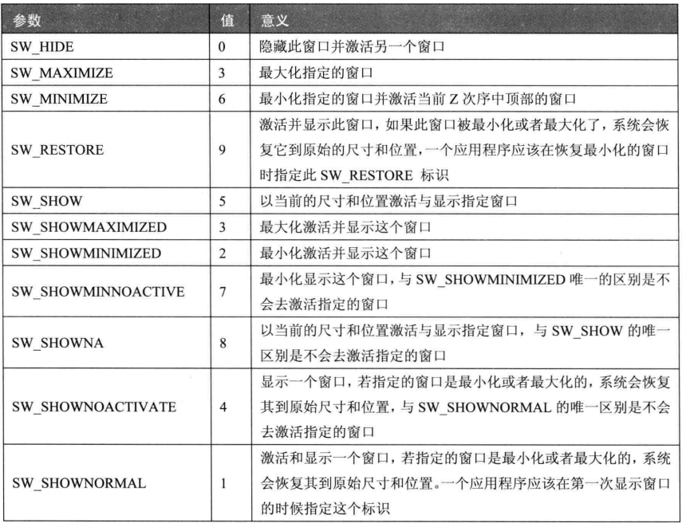

## WinMain函数

#### 3.3.1 WinMain函数

```C++
int WINAPI WinMain (
    _In_ HINSTANCE hInstance,
    _In_opt_ HINSTANCE hPrevInstance,
    _In_ LPSTR lpCmdLine,
    _In_ int nShowCmd
    );
```

* hInstance：操作系统分配给该程序的实例句柄
* hPrevInstance：WIN32下没用
* lpCmdLine：命令行参数字符串
* nShowCmd：窗口显示的模式
	* 

#### 3.3.2 MessageBox函数

```C++
int
WINAPI
MessageBoxW(
    _In_opt_ HWND hWnd,
    _In_opt_ LPCWSTR lpText,
    _In_opt_ LPCWSTR lpCaption,
    _In_ UINT uType);
```

功能：

* 弹出一个窗口
* 可以设置Warning或者Error图标类型
* 可以设置`确定取消`等按钮

#### 3.3.3 PlaySound函数

```C++
BOOL
WINAPI
PlaySoundW(
    _In_opt_ LPCWSTR pszSound,
    _In_opt_ HMODULE hmod,
    _In_ DWORD fdwSound
    );
```

#### 3.3.4 案例

```C++
#include <Windows.h>
#pragma comment(lib,"winmm.lib")
int WINAPI WinMain(HINSTANCE hInstance, HINSTANCE hPrevInstance, LPSTR lpCmdLine, int nCmdShow)
{
	PlaySound(L"FirstBlood.wav", NULL, SND_FILENAME | SND_ASYNC);
	MessageBox(NULL, L"FirstBlood!", L"FirstBlood 游戏窗口", 0);
	return 0;
}
```

