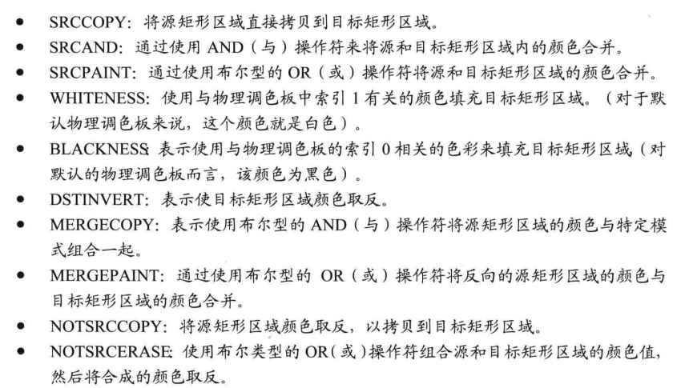

## 位图绘制基础

四部曲：

* 从文件中加载位图
* 建立兼容DC（与设备DC兼容）
* 内存DC使用位图对象
* 将内存DC贴到窗口DC上

#### 1.加载位图

```C++
HANDLE LoadImageW(
  [in, optional] HINSTANCE hInst,
  [in]           LPCWSTR   name,
  [in]           UINT      type,
  [in]           int       cx,
  [in]           int       cy,
  [in]           UINT      fuLoad
);

//example
HBITMAP g_hBitmap = (HBITMAP)LoadImage(NULL, L"Dota2.bmp", IMAGE_BITMAP, 800, 600, LR_LOADFROMFILE);
```

#### 2.建立兼容DC

> 创建一个与设备环境兼容的内存设备环境。

```C++
HDC CreateCompatibleDC(			//创建
  [in] HDC hdc
);

BOOL DeleteDC(					//销毁
	__in HDC hdc
);

//example
HDC m_hdc = CreateCompatibleDC(hdc);
DeleteDC(m_hdc);
```

#### 3.选用位图对象

```C++
SelectObject();
```

#### 4.进行贴图

```C++
BOOL BitBlt(
  [in] HDC   hdc,		//目标设备环境句柄
  [in] int   x,			//目标DC的x
  [in] int   y,			//目标DC的y
  [in] int   cx,		//贴到目标DC的宽度
  [in] int   cy,		//贴到目标DC的高度
  [in] HDC   hdcSrc,	//源设备环境句柄
  [in] int   x1,		//源x
  [in] int   y1,		//源y
  [in] DWORD rop		//贴图方式(下方)
);

//example
BitBlt(g_hdc, 0, 0, WINDOW_WIDTH, WINDOW_HEIGHT, g_mdc, 0, 0, SRCCOPY);
```

