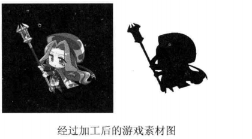

## 透明遮罩法

> 需要专门去制作遮罩图



* 将遮罩图和背景图做与运算，将结果贴到设备环境DC上
* 将前景图和背景图做或运算，将结果贴到设备环境DC上

#### 1.代码表示

```C++
BitBlt(g_hdc, 0, 150, 350, 350, g_mdc, 350, 0, SRCAND);	//第一步，做AND运算
BitBlt(g_hdc, 0, 150, 350, 350, g_mdc, 0, 0, SRCPAINT);	//第二步，做OR运算
```

