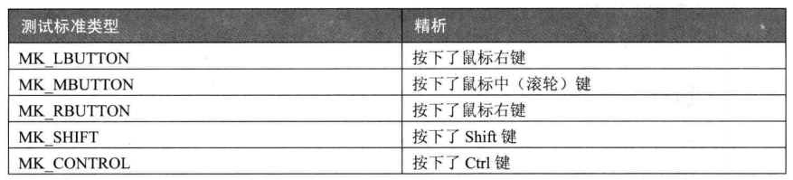

## Windows鼠标消息处理

> 在鼠标消息处理中，message传入鼠标消息类型，而`wParam`和`lParam`存储了具体的值。

#### 1.lParam参数

> 该参数的高位部分存储了鼠标光标的x，低位存储了鼠标光标的y。（相对于内部窗口）获取方法如下：

```C++
WORD LOWORD(DWORD dwValue);		//y
WORD HIWORD(DWORD dwValue);		//x
```

#### 2.wParam参数

> 该参数记录了鼠标按键和键盘上Ctrl、Shift的状态信息。



使用方法：

```C++
if(wParam & MK_LBUTTON)
{
    ...;
}
```

> 综合判断左键单击同时按下ctrl

```C++
if(wParam & MK_LBUTTON)
{
    if(wParam & MK_CONTROL)
    {
        ...;
    }
}
```

#### 3.滚轮消息

> wParam参数的高位记录了鼠标键、Ctrl、Shift的信息，低位则记录了鼠标滚轮的信息。

```C++
HIWORD(wParam);		//高位为120为向前滚，-120为向后滚
```

