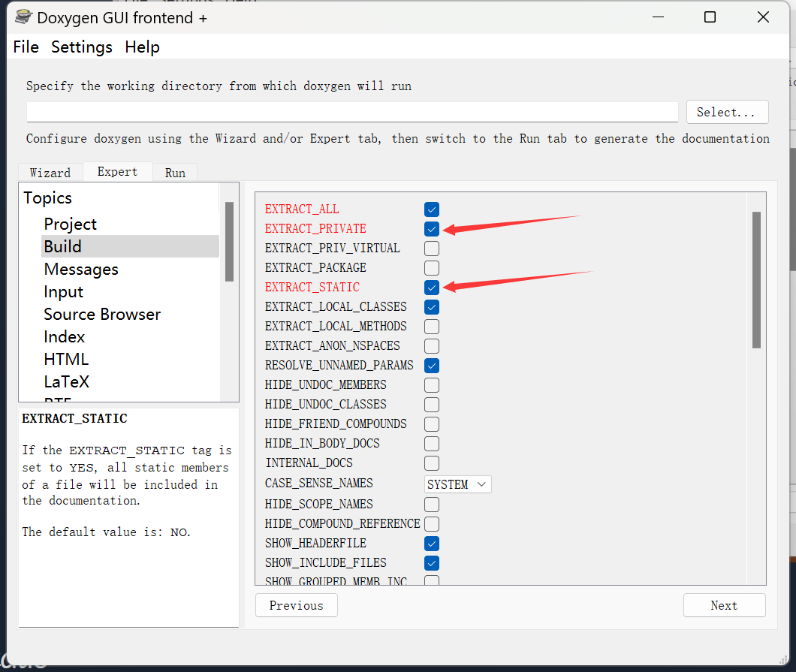

# 更改导航栏和项目简介

## 添加简介

​	勾选`JAVADOC_AUTOBRIEF`，用于生成文件list中每个文件对应的描述。

## 添加侧边栏

​	勾选`GENERATE_TREEVIEW`，用于打开侧边栏。

## 抽取所有文件

​	勾选`EXTRACT_ALL`，将没有注释的文件也抽取出来。

## 抽取private和static

​	勾选`EXTRACT_PRIVATE`和`EXTRACT_STATIC`，可以将类的私有变量和静态变量也抽取出来。

## 参考资料

* https://www.bilibili.com/video/BV1ZE411F7kW