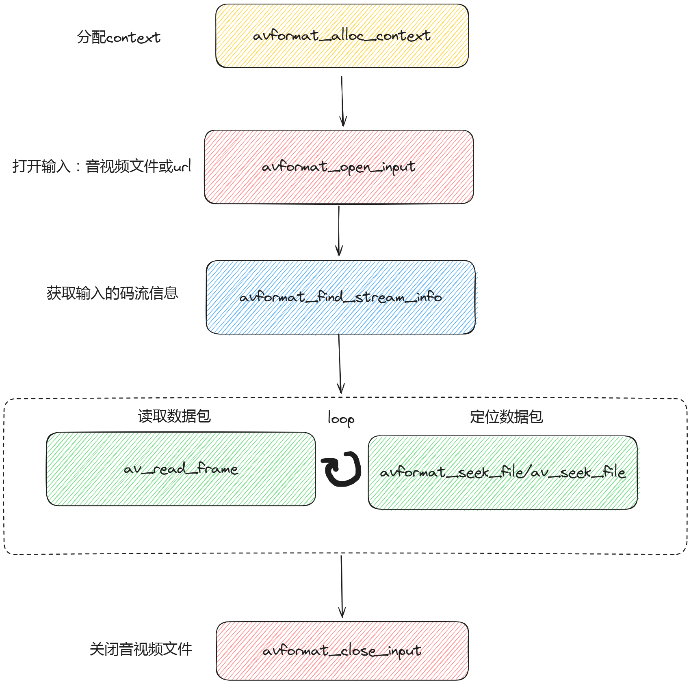

# 解封装函数



## **avformat_alloc_context()**

- 定义: 分配并初始化一个 `AVFormatContext` 结构体。与`avformat_free_context`结合使用。
- 使用示例:
  ```c
  AVFormatContext *fmt_ctx = NULL;
  fmt_ctx = avformat_alloc_context();
  if (!fmt_ctx) {
      fprintf(stderr, "Could not allocate format context\n");
      exit(1);
  }
  ```

## **avformat_free_context()**

- 定义: 释放 `AVFormatContext` 及其所有子结构。与`avformat_alloc_context`结合使用。
- 使用示例:
  ```c
  avformat_free_context(fmt_ctx);
  ```

## **avformat_close_input()**

- 定义: 关闭输入媒体文件，并释放 `AVFormatContext`。与`avformat_open_input`结合使用。
- 使用示例:
  ```c
  avformat_close_input(&fmt_ctx);
  ```

## **avformat_open_input()**

- 定义: 打开媒体文件进行读取。与`avformat_close_input`结合使用。
- 使用示例:
  ```c
  int ret = avformat_open_input(&fmt_ctx, "input.mp4", NULL, NULL);
  if (ret < 0) {
      fprintf(stderr, "Could not open input file\n");
      exit(1);
  }
  ```

## **avformat_find_stream_info()**

- 定义: 扫描媒体文件以获取流信息。

- 说明：获取的流信息存储在 `AVFormatContext` 结构体的各个字段中，核心是其 `streams` 数组里。每个元素代表媒体文件中的一个流（stream），类型是 `AVStream`。

  下面是`AVFormatContext`获取的信息字段：

  - `ic->nb_streams`: 表示媒体文件中流的数量。

  - `ic->streams`: 一个由 `AVStream` 结构体组成的数组，每个 `AVStream` 实例包含了一个特定流的所有信息。

    下面是每个`AVStream`的字段：

    - `st->codecpar`: 指向 `AVCodecParameters` 结构体的指针，其中包含了流的编解码参数，如编码格式、比特率、宽度、高度等。
    - `st->codec`: 指向 `AVCodecContext` 结构体的指针，如果已经打开解码器，这里会包含解码器的详细信息。
    - `st->time_base`: 表示该流的时间基准，用于将时间戳转换为秒。
    - `st->duration`: 流的持续时间，以时间基准为单位。
    - `st->start_time`: 流中的首个帧的起始时间戳。
    - `st->bit_rate`: 流的比特率。

- 使用示例:
  ```c
  ret = avformat_find_stream_info(fmt_ctx, NULL);
  if (ret < 0) {
      fprintf(stderr, "Could not find stream information\n");
      exit(1);
  }
  ```

## **av_read_frame()**

- 定义: 从媒体文件中读取一个数据包。该函数返回一个 `AVPacket`，这个数据包可能属于任何一个流。
- 备注：如果需要确定数据包属于哪个流，可以使用 `AVPacket` 的 `stream_index` 字段，它指示了数据包所属的流在 `AVFormatContext` 的 `streams` 数组中的索引。然后可以使用这个索引来访问相应的 `AVStream`，获取关于该流的信息。

>在多媒体容器格式（如 MP4、MKV、AVI 等）中，不同的媒体流（如视频流、音频流、字幕流等）通常是交错存储的，而不是每个流单独存储在文件的特定部分。这意味着在文件中，数据包（packets）是按照它们在时间线上出现的顺序交错存储的，而不是按照流的类型顺序存储。
>
>当使用 FFmpeg 的 `av_read_frame` 函数从媒体文件中读取数据时，它会从交错存储的数据包中按顺序读取一个数据包，而不管这个数据包属于哪个流。这就是为什么 `av_read_frame` 可以从媒体文件中读取出一个包，而不是从一个 `AVStream` 中读取出的原因。

- 使用示例:
  ```c
  AVPacket pkt;
  while (av_read_frame(fmt_ctx, &pkt) >= 0) {
      // 处理数据包
      av_packet_unref(&pkt);
  }
  ```

## **avformat_seek_file()**

​	定义: 在媒体文件中根据指定流进行定位。

```C
int avformat_seek_file(AVFormatContext *ic,
                       int stream_index,  // 流在streams数组中的索引
                       int64_t min_ts,    // 最小时间戳（起始位置）
                       int64_t ts,        // 要定位到的时间戳
                       int64_t max_ts,    // 最大时间戳（结束位置）
                       int flags);        // 定位标志
```

参数说明：

1. **ic** (`AVFormatContext *`): 指向 `AVFormatContext` 结构的指针。
2. **stream_index** (`int`): 指定要定位的流的索引。如果设置为 `-1`，则表示在所有流上执行定位。
3. **min_ts** (`int64_t`): 定位操作的最小时间戳（以秒为单位的整数）。如果需要定位到文件的开始位置，可以设置为 `INT64_MIN`。
4. **ts** (`int64_t`): 要定位到的确切时间戳。这是定位操作的目标时间位置。
5. **max_ts** (`int64_t`): 定位操作的最大时间戳。如果需要定位到文件的结束位置，可以设置为 `INT64_MAX`。
6. **flags** (`int`): 用于控制定位行为的一组标志位。常见的标志有：
   - `AVSEEK_FLAG_BACKWARD`: 定位时寻找 `<= ts` 的位置，而不是 `> ts`。
   - `AVSEEK_FLAG_FORWARD`: 定位时寻找 `>= ts` 的位置。
   - `AVSEEK_FLAG_ANY`: 寻找最接近 `ts` 的位置，不管在 `ts` 之前还是之后。
   - `AVSEEK_FLAG_FRAME`: 定位到最近的帧，主要用于精确定位。

返回值：

- 成功时，返回新位置的时间戳。
- 失败时，返回负数，表示定位失败。

---

- 使用示例:
  ```c
  ret = avformat_seek_file(fmt_ctx, -1, INT64_MIN, 0, INT64_MAX, 0);
  if (ret < 0) {
      fprintf(stderr, "Could not seek file\n");
      exit(1);
  }
  ```

## **av_seek_frame()**

​	定义: 根据指定的帧号在媒体文件中进行定位。

​	不同：与 `avformat_seek_file` 函数不同，`av_seek_frame` 允许更精确的定位到单个流中的特定帧，而 `avformat_seek_file` 通常用于定位到关键帧或者时间点。

```C
int av_seek_frame(AVFormatContext *ic,
                   int stream_index,
                   int64_t timestamp,
                   int flags);
```

​	参数说明：

1. **ic** (`AVFormatContext *`): 指向 `AVFormatContext` 结构的指针，包含了多媒体文件的上下文信息。
2. **stream_index** (`int`): 指定要定位的流的索引。与 `avformat_seek_file` 不同，这里不能使用 `-1`，必须指定一个有效的流索引。
3. **timestamp** (`int64_t`): 要定位到的时间戳（以微秒为单位）。这个时间戳是相对于流的时间基（time base）的。
4. **flags** (`int`): 控制定位行为的标志位，可以是以下值：
   - `AVSEEK_FLAG_BACKWARD`: 寻找 `<= timestamp` 的位置。
   - `AVSEEK_FLAG_FORWARD`: 寻找 `>= timestamp` 的位置。
   - `AVSEEK_FLAG_ANY`: 寻找最接近 `timestamp` 的位置，不管在 `timestamp` 之前还是之后。
   - `AVSEEK_FLAG_FRAME`: 用于帧级别的定位，结合其他标志位使用。

---

- 使用示例:

  ```c
  ret = av_seek_frame(fmt_ctx, video_stream_idx, target_frame_pts, AVSEEK_FLAG_ANY);
  if (ret < 0) {
      fprintf(stderr, "Could not seek to frame\n");
      exit(1);
  }
  ```

