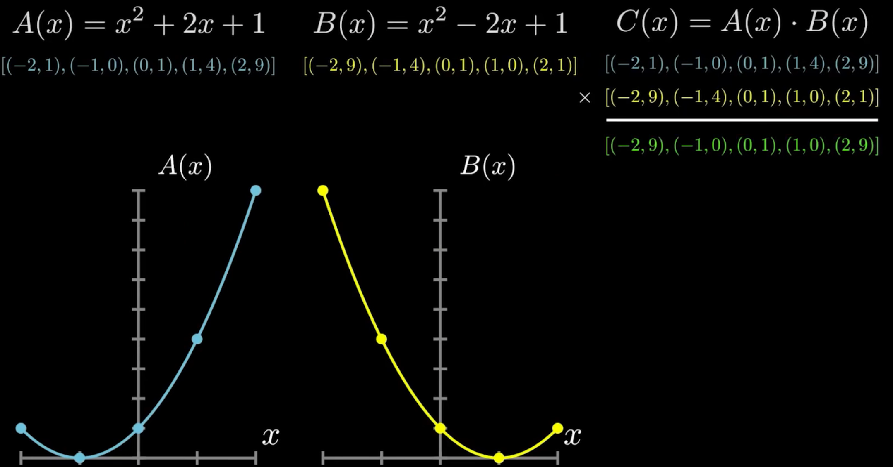
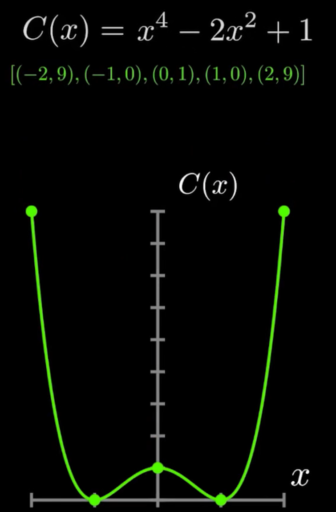
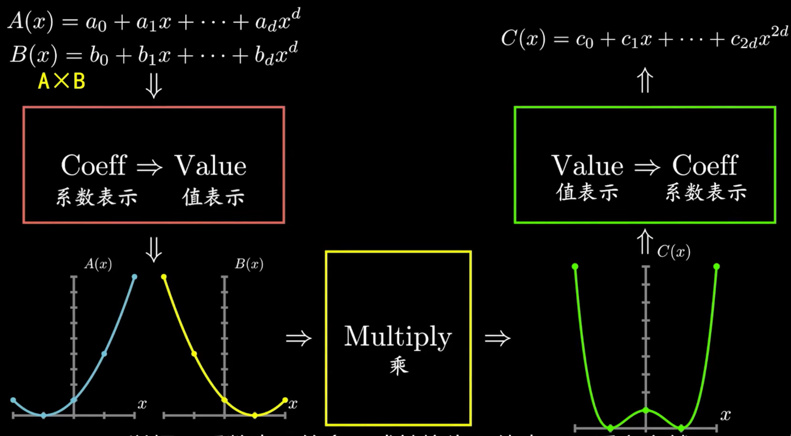
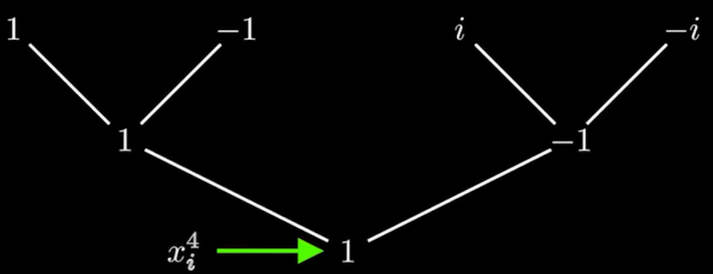
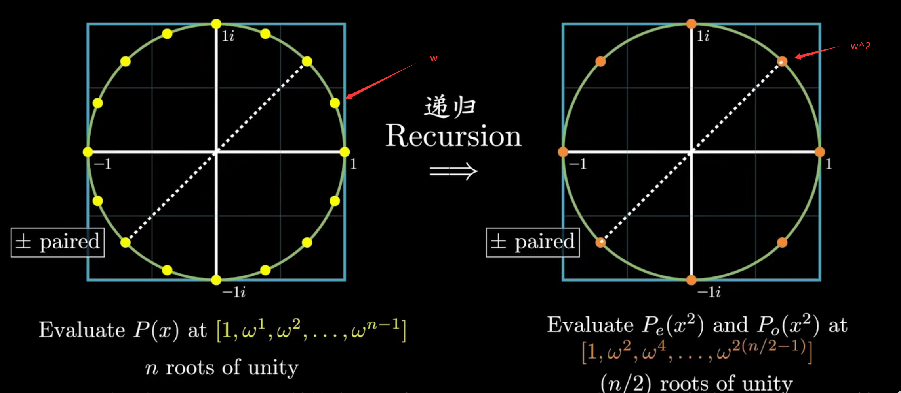

# fft

## 1.多项式的值表示法

​	已知对于一个$d$次多项式$P(x) = p_0+p_1x+p_2x^2+\cdots +p_dx^d$，除了可以使用其系数向量$[p_0,p_1,\cdots,p_d]$来唯一确定外（称之为**系数表示**），还可以通过几何的方法去确定：

​	$(d+1)$个点唯一对应了一个$d$次多项式。（值表示）

**证明如下**

​	假设该$d$次多项式为$P(x) = p_0+p_1x+p_2x^2+\cdots +p_dx^d$，这$(d+1)$个点为：${(x_0,P(x_0)),(x_1,P(x_1)),\cdots,(x_d,P(x_d))}$。用矩阵表示为：

​	$\begin{bmatrix}P(x_0)\\P(x_1)\\\vdots\\P(x_d)\end{bmatrix} = \begin{bmatrix}1&x_0&x_0^2&\cdots&x_0^d\\1&x_1&x_1^2&\cdots&x_1^d\\\vdots&\vdots&\vdots&\ddots&\vdots\\1&x_d&x_d^2&\cdots&x_d^d\end{bmatrix} \begin{bmatrix}p_0\\p_1\\\vdots\\p_d\end{bmatrix}$

​	对于$x$坐标构成的矩阵$M$，如果每一个原始点都是唯一的，则该矩阵$M$的行列式一定不为0，即该矩阵一定是可逆的。从而证明对于唯一的一组值$x_0,x_1,\cdots,x_d$，都存在唯一的一组系数$p_0,p_1,\cdots,p_d$与之对应。由此证明了存在唯一的多项式$P(x)$与之对应。

## 2.使用值表示计算多项式的乘法

​	对于原来系数表示法，计算两个$d$次多项式的乘积$A(x)*B(x)$，时间复杂度为$O(d^2)$。

​	而对于值表示的$d$次多项式乘法，已知计算出来的多项式次数为$2d$，因此只需在两个原多项式上选择$(2*d+1)$个自变量相同的点，对因变量进行乘法，即可得到唯一对应的$2d$次多项式。此时的时间复杂度为$O(d)$。

---

​	下面是两个二次多项式相乘的例子：

​	


## 3.快速计算的流程图

​	为了实现快速计算，可以将系数表示的多项式转为值表示，进行计算后，再转回系数表示。

​	现在问题的关键在于$系数\rightarrow 值$和$值\rightarrow 系数$的过程如何进行。




## 4.求值过程

​	由$系数\rightarrow值$，如果任意选择$n(n\geq 2*d+1)$个点作为自变量$x$，对其进行求值，得到对应$n$个的$P(x)$，则求值过程需要$O(n)$，最终算法复杂度为$O(nd)=O(d^2)$，失去了快速的能力。

**简化思路**

​	对于$P(x)$中的奇数项（记作$P_o(x)$），可以通过求出$P_o(x_i)$的值得到$P_o(-x_i)=-P_o(x_i)$，简化了一半计算量。

​	对于$P(x)$中的偶数项（记作$P_e(x)$），可以通过求出$P_e(x_i)$的值得到$P_e(-x_i)=P_e(x_i)$，同样简化了一半计算量。

​	由此，得到下面的式子：

​		$P(x) = P_e(x)+P_o(x)=P_{e2}(x^2)+xP_{o2}(x^2)$

​		$P(-x) = P_e(x)-P_o(x)=P_{e2}(x^2)-xP_{o2}(x^2)$

​	将$x^2$作为输入，则分解后的多项式$P_{o2},P_{e2}$的最高次项只有$\frac{n}{2}-1$。

​	若能将这个式子递归使用，就能将算法简化到$O(nlogn)$的地步。

​	递归的目的是为了让原始多项式的次数降低一半，由此降低了一半的计算量。

​	注意：递归的条件是，每一层都要找出$n/2$个正负配对点，$n$为初始点数，每下一层，$n=n/2$。

​	第一层的点集设置为：$[\pm x_1,\pm x_2,\cdots,\pm x_{n/2}]$。

​	第二层的点集为$[x_1^2,x_2^2,\cdots,x_{n/2}^2]$，不能找到正负匹配的点，算法递归无法继续进行。

## 5.扩展数域

​	对于实数域的点，不存在若干个$x_1^2 = -x_x^2$的数（只有0一个是不够的）。因此，将数域扩展至复数域。

## 6.四次单位方根

​	例如：对于$P(x)=x^3+x^2-x+1$，需要四个自变量$x_1,-x_1,x_2,-x_2$来表示（递归条件为**两两正负配对**）。递归一层后，需要两个自变量$x_1^2,x_2^2$。再次递归的条件为$x_1^2 = -x_2^2$。

​	若令$x_1=1$，则$-x_1 = -1$，$x_2 = i$，$-x_2=-i$。满足。



## 7. $2^n$次单位方根的一般推广形式

​	对于$n$个点（此处可以明确：$n为\geq d的最小2次幂$），是否可以如上一样推广出$2_n$次方根？

​	令$\omega_n = e^{i*\frac{2\pi}{n}}$，用于表示将**复数域的单位圆**分为$n$份后，逆时针的第一个点（第$j$个点为$\omega_n^j$）。同时$-\omega_n^j = \omega_n^{(j+\frac{n}{2})}$

​	由此分出单位圆上的n个点，该点集都两两互为正负配对点。递归一次后，点数减半；同时新的点$\omega_{n/2}=\omega_n^2$是原来$\omega_n$的角度的两倍。同时，新的点集又两两互为正负配对点。



## 8.代码实现

​	由此完成了$系数\rightarrow 值$的过程，下面是代码实现：

$y_e[j]=P_e(\omega^{2j})\\y_o[j]=P_o(\omega^{2j})$

```python
"""
FFT(P): return y
input： list 系数P
output：list 值y
"""
def FFT(P):
    # P 为 [p0,p1,...,pn-1]
    n = len(P)	# n is a power of 2
    if n==1:
        return P
    w = e**(2*np.pi*np.i/n)
    Pe, Po = [pi for pi in P if i % 2 == 0], [pi for pi in P if i % 2 == 1]
    ye, yo = FFT(Pe), FFT(Po)
    # init output list
    y = [0] * n
    for j in range(n/2):
        y[j] = ye[j] + w**j * yo[j]
        y[j + n/2] = ye[j] - w**j *yo[j]
    return y
```

