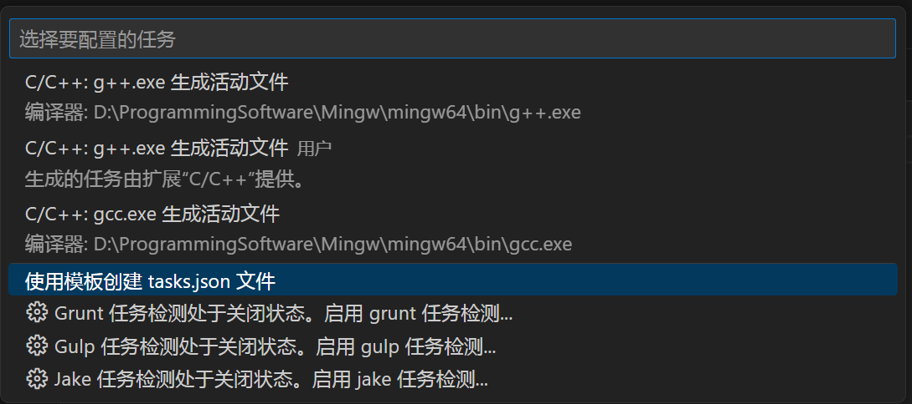
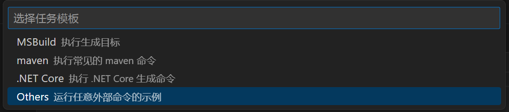
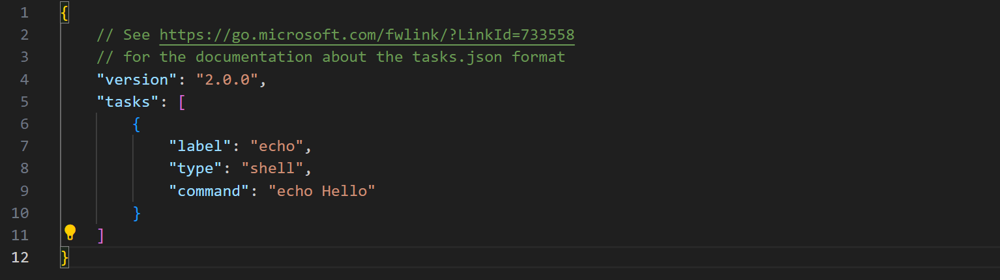
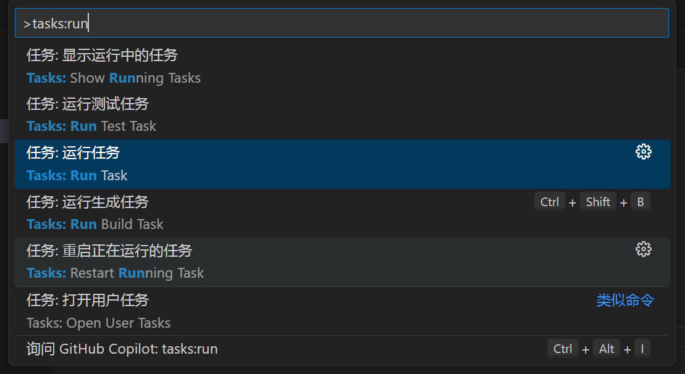

# task属性

## 1. 新建tasks.json

`ctrl+shift+p`，输入`Tasks: Configure Task`，新建一个`tasks.json`文件：

得到如下`tasks.json`：

## 2. 运行task

`ctrl+shift+p`，输入`Tasks: Run Task`，即可运行任务。

## 3. task属性说明

- **label**
    - **含义**：任务的名称，用于在命令面板中显示，标识任务。
    - **取值**：任意字符串，但需要在当前 `tasks.json` 文件中唯一。
- **type**
    - **含义**：任务的类型。
    - **取值**：
        - `shell`：命令将在默认的 Shell 中执行（例如 bash、cmd 或 PowerShell）。
        - `process`：命令将作为独立进程运行。
        - `cppbuild`：用于 C++ 项目的构建任务（需要安装 C++ 扩展）。
- **command**
    - **含义**：要执行的命令。
    - **取值**：可以是外部程序的路径，也可以是 Shell 命令。
- **args**
    - **含义**：传递给命令的参数。
    - **取值**：字符串数组。
- **group**
    - **含义**：定义任务所属的组。
    - **取值**：
        - `build`：构建组。
        - `test`：测试组。
        - `other`：其它类型
        - `{ "kind": "build", "isDefault": true }`：将该任务标记为构建组的默认任务。
- **presentation**
    - **含义**：控制任务输出的呈现方式。
    - **取值**：
        - `reveal`：控制终端显示行为，取值为 `always`（始终显示）、`silent`（不显示）或 `never`。
        - `panel`：控制终端面板的行为，取值为 `shared`（共享面板）、`dedicated`（专用面板）或 `new`（每次创建新面板）。
        - `focus`：是否将焦点放在终端面板上，取值为布尔值。
        - `echo`：是否在终端中显示执行的命令，取值为布尔值。
- **problemMatcher**
    - **含义**：用于从任务输出中解析错误和警告的匹配器。
    - **取值**：可以是字符串（内置匹配器名称，如 `$gcc`、`$eslint` 等），也可以是复杂的正则表达式。
- **options**
    - **含义**：任务执行的选项。
    - **取值**：
        - `cwd`：设置当前工作目录。
        - `env`：以键值对形式设置环境变量。
        - `shell`：指定用于执行任务的 Shell，可以是路径或环境变量。
- **dependsOn**
    - **含义**：任务运行前需要先执行的依赖任务。
    - **取值**：任务标签的数组，例如 `["task-a", "task-b"]`。
- **dependsOrder**
    - **含义**：依赖任务的执行顺序。
    - **取值**：`sequence`，表示按照 `dependsOn` 中的顺序依次执行。
- **isBackground**
    - **含义**：任务是否在后台运行。
    - **取值**：布尔值，`true` 或 `false`。
- **runOptions**
    - **含义**：定义任务的运行方式。
    - **取值**：
        - `runOn`：任务的触发方式，取值为 `default`（默认方式）或 `folderOpen`（文件夹打开时运行）。
        - `instanceLimit`：任务的最大运行实例数。
- **windows**、**linux**、**osx**
    - **含义**：分别用于指定 Windows、Linux 和 macOS 系统下的特定属性。
    - **取值**：可以包含 `command`、`args` 和 `options` 等属性。