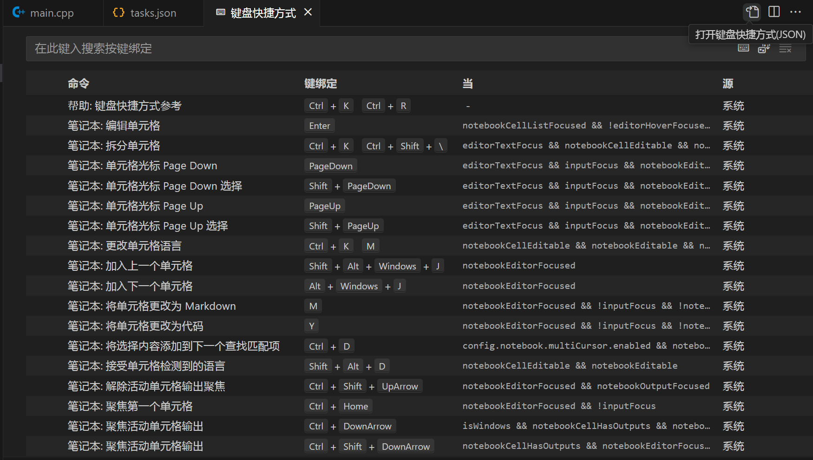

# 为task绑定快捷键

设置好task后，可以为task绑定快捷键。

通过ctrl+K, ctrl+S，打开快捷键设置，然后点击右上角的json视图：



配置json文件：

```json
// 将键绑定放在此文件中以覆盖默认值
[
    {
        "key": "ctrl+b",	// 快捷键
        "command": "workbench.action.tasks.runTask",	// 执行任务
        "args": "build",	// task label
    }
]
```