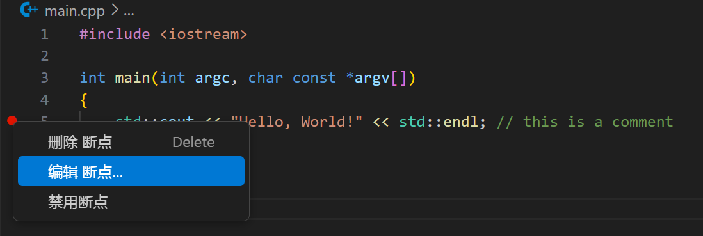
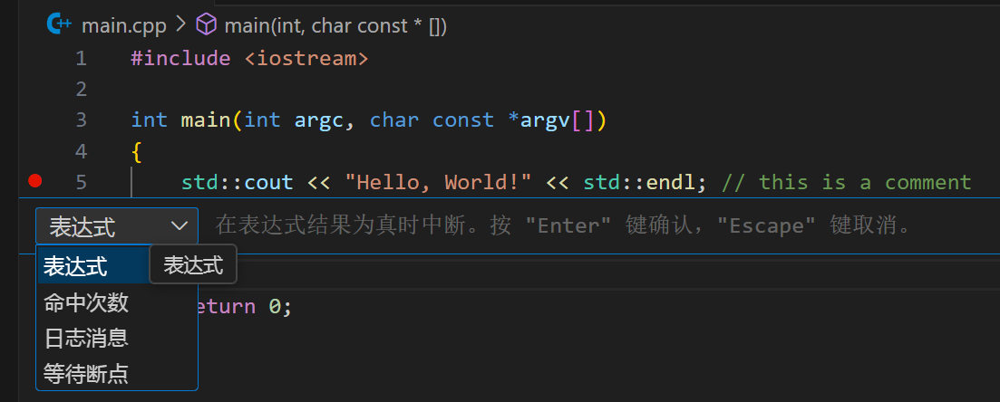
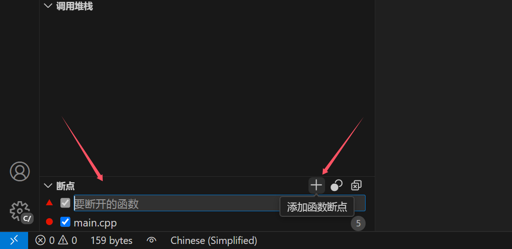
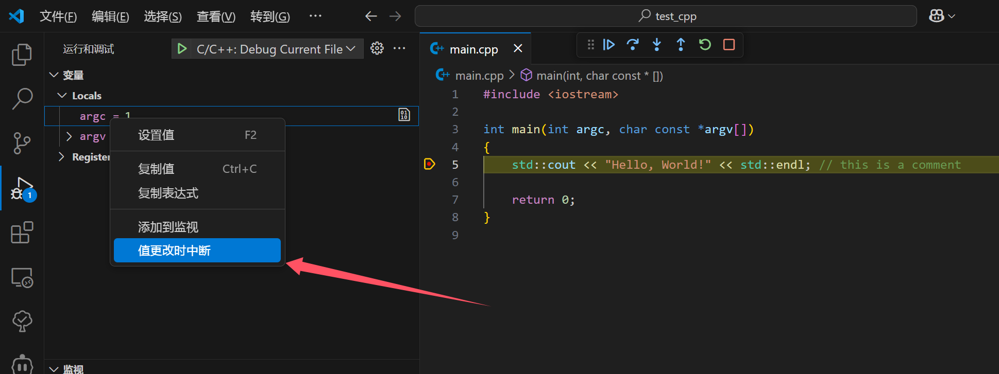

# vscode gdb 高级断点

vscode对gdb的支持，有很多高级断点：

* 条件断点：当条件符合要求时则会触发
* 命中次数断点：该行命中次数达到要求时则触发
* 日志断点：不会中断，而是会继续执行，但是同时会输出日志
* 函数断点：等价于gdb中的`b f`，假如`f`是函数名。
* 更改时中断：当变量被更改时，中断触发

## 条件断点、命中次数断点和日志断点

## 函数断点

## 值更改中断

